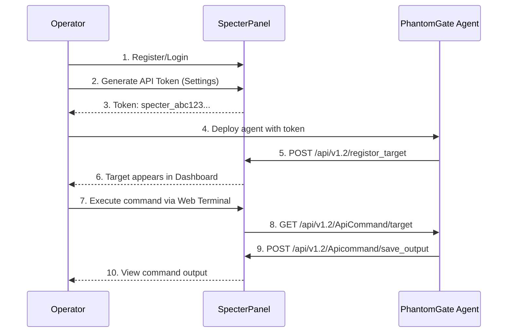

# SpecterPanel – a C2 thing that actually works (mostly)

<p align="center">
  
</p>

Yeah, it's another C2 panel. But this one is mine.  
Built for red teams, pentesters, and anyone who needs to manage remote agents without losing their mind.

---

## ⚠️ Before you do anything stupid

This is for **authorised testing only**.  
If you point this at systems you don't own, that's illegal. I don't care what excuses you have.  
You break the law, you deal with the consequences. Not me.

---

## What's inside?

- Web dashboard – see your agents at a glance
- Browser terminal – run commands like you're on a real shell
- Code injection panel – generate payloads with a bit of AI help
- Botnet manager – keep track of all connected machines
- API gateway – all agent comms go through here, encrypted with AES‑256
- SQLite DB – stores targets, commands, output, users

No bloat. Just what you need.

---

## How it works (quick flow)


```mermaid
sequenceDiagram
    
    Operator ->> SpecterPanel: 1. Register/Login
    Operator ->> SpecterPanel: 2. Generate API Token (Settings)
    SpecterPanel -->> Operator: 3. Token: specter_abc123...
    Operator ->> PhantomGate Agent: 4. Deploy agent with token
    PhantomGate Agent ->> SpecterPanel: 5. POST /api/v1.2/registor_target
    SpecterPanel -->> Operator: 6. Target appears in Dashboard
    Operator ->> SpecterPanel: 7. Execute command via Web Terminal
    SpecterPanel ->> PhantomGate Agent: 8. GET /api/v1.2/ApiCommand/target
    PhantomGate Agent ->> SpecterPanel: 9. POST /api/v1.2/Apicommand/save_output
    SpecterPanel -->> Operator: 10. View command output
```

That's the gist. Agent checks in, gets commands, sends back output. You watch from your browser.

---

## Project layout (the messy part)

```
SPECTERPANEL/
├── api/             # endpoints agents talk to
├── db/              # database models + session handling
├── event/           # error handlers (404, 500)
├── log/             # where errors go to die
├── static/          # CSS, JS, payload templates
├── utility/         # config, helpers, email templates
├── view/            # Flask blueprints for each UI
├── templates/       # HTML files (Jinja2)
├── screen_shot/     # images for this README
├── app.py           # main entry point
├── initial_db.py    # creates tables and admin user
└── requirements.txt # dependencies
```

Yes, `mange_db.py` is misspelled. I'll fix it someday.

---

## Getting it running

```bash
git clone https://github.com/omerKkemal/oh-tool-v2.git
cd oh-tool-v2

# set up virtual environment
python3 -m venv venv
source venv/bin/activate   # or .\venv\Scripts\activate on Windows

# install stuff
pip install -r requirements.txt

# IMPORTANT: edit utility/setting.py and set ENCRYPTION_KEY to a real 32-byte key
# don't skip this, or encryption is worthless

# create database and default admin
python initial_db.py

# run it
flask run --host=0.0.0.0 --port=5000
```

Open `http://localhost:5000`. Login with the credentials shown after running `initial_db.py`.

---

## API endpoints (for agent developers)

| Method | Endpoint | What it does |
|--------|----------|---------------|
| `GET` | `/api/v1.2/ApiCommand/<target>` | fetch pending commands |
| `POST` | `/api/v1.2/Apicommand/save_output` | submit command result |
| `GET` | `/api/v1.2/BotNet/<target>` | get botnet instructions |
| `POST` | `/api/v1.2/registor_target` | register a new target |
| `GET` | `/api/v1.2/get_instraction/<target>` | pull operational instructions |
| `GET` | `/api/v1.2/injection/lib/<target>` | download payload file |
| `POST` | `/api/v1.2/injection/code_output_save/<target>` | save injection output |

All requests/responses are wrapped in AES-256-EAX. The format:

```json
{
  "nonce": "base64...",
  "ciphertext": "base64...",
  "tag": "base64..."
}
```

If you don't encrypt, the server will ignore you.

---

## Screenshots (because you want to see it before trying)

<div align="center">

### Dashboard Overview

*Real-time operational command center showing connected targets and system status*

---

### Web Terminal

*Browser-based remote command execution with real-time output*

---

### Code Injection Panel

*AI‑enhanced Python payload management and deployment interface with dynamic model selector*

---

### BotNet Management

*BotNet deployment and management interface*

---

### Settings Panel

*Platform configuration, encryption key management, and system settings*

---

### Login Interface

*Secure authentication portal with registration option*

---

### Home Page

*Landing page and platform overview*

</div>

---

## Who made this?

**Omer Kemal** – security researcher, developer, caffeine addict.

- C2: [SpecterPanel](https://github.com/omerKkemal/oh-tool-v2)
- Agent: [PhantomGate](https://github.com/omerKkemal/PhontomGate)

Found a bug? Open an issue. Want to improve something? Send a PR.  
Rude comments? Keep them to yourself.

---

## License

Proprietary – all rights reserved.  
Don't copy the whole thing and sell it. For licensing questions: omerkemal2019@gmail.com

---

<p align="center">
  <sub>No warranty, no promises. Use at your own risk. And don't be a script kiddie.</sub>
</p>