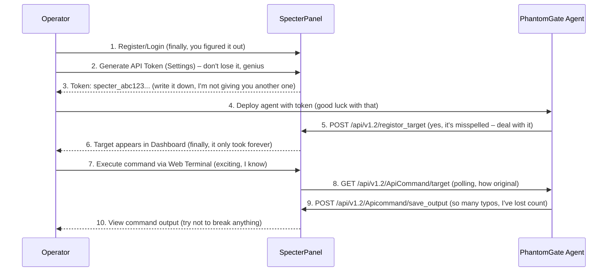

# SpecterPanel – because the world desperately needed another C2 panel

<p align="center">
  
</p>

Oh great, another C2 panel. Because there definitely aren't enough of these already.  
Built for red teams, pentesters, and anyone who needs to manage remote agents without losing what's left of their sanity.  
Good luck with that. You're gonna need it.

---

## ⚠️ Before you do anything stupid (read this or cry later – your choice)

This is for **authorised testing only**.  
If you point this at systems you don't own, that's illegal. I don't care what excuses you have.  
"I was just testing" won't hold up in court. Neither will "I didn't know."  
You break the law, you deal with the consequences. Not me. I'm busy. Probably debugging something else I broke.

---

## The Trojan Horse – PhontomGate GUI

Yes, there's a GUI for the agent. Because apparently not everyone wants to live in a terminal.

**Check it out:** [PhontomGate Flet App](https://github.com/omerKkemal/flet-apps/tree/main/PhontomGate)

It's a Flet-based Trojan horse that gives you:
- A pretty interface for controlling PhantomGate (because buttons are fun)
- Cross-platform desktop and Android support (the nightmare must be portable)
- A way to pretend you're a real hacker with a GUI (no judgment here)
- The same C2 functionality, just with a friendly mask hiding the horror

Build it as an APK, EXE, or web app – spread the infection.  
*You didn't find it. It found you.*

---

## What's inside? (spoiler: it's not that impressive)

- Web dashboard – see your agents at a glance (groundbreaking stuff, I know)
- Browser terminal – run commands like you're on a real shell (wow, so innovative)
- Code injection panel – generate payloads with a bit of AI help (fancy, aren't we)
- Botnet manager – keep track of all connected machines (try not to lose count, genius)
- API gateway – all agent comms go through here, encrypted with AES‑256 (because plaintext is for amateurs)
- SQLite DB – stores targets, commands, output, users (the boring stuff nobody reads)

No bloat. Just what you need. And a few things you don't.  
Like my sarcasm. But here we are. Deal with it.

---

## How it works (quick flow – try to keep up, I know it's complicated)


```mermaid
sequenceDiagram
    
    Operator ->> SpecterPanel: 1. Register/Login (finally, you figured it out)
    Operator ->> SpecterPanel: 2. Generate API Token (Settings) – don't lose it, genius
    SpecterPanel -->> Operator: 3. Token: specter_abc123... (write it down, I'm not giving you another one)
    Operator ->> PhantomGate Agent: 4. Deploy agent with token (good luck with that)
    PhantomGate Agent ->> SpecterPanel: 5. POST /api/v1.2/registor_target (yes, it's misspelled – deal with it)
    SpecterPanel -->> Operator: 6. Target appears in Dashboard (finally, it only took forever)
    Operator ->> SpecterPanel: 7. Execute command via Web Terminal (exciting, I know)
    SpecterPanel ->> PhantomGate Agent: 8. GET /api/v1.2/ApiCommand/target (polling, how original)
    PhantomGate Agent ->> SpecterPanel: 9. POST /api/v1.2/Apicommand/save_output (so many typos, I've lost count)
    SpecterPanel -->> Operator: 10. View command output (try not to break anything)
```

That's the gist. Agent checks in, gets commands, sends back output. You watch from your browser.  
It's not rocket science. It's just HTTP with extra steps. And typos. So many typos. I should probably fix those. Nah.

---

## Project layout (the messy folder tree that nobody asked for)

```
SPECTERPANEL/
├── api/             # endpoints agents talk to (if they can find them)
├── db/              # database models + session handling (the boring stuff)
├── event/           # error handlers (404, 500 – you'll see these a lot, trust me)
├── log/             # where errors go to die (and they will, oh they will)
├── static/          # CSS, JS, payload templates (the pretty stuff that makes it look professional)
├── utility/         # config, helpers, email templates (the behind-the-scenes magic)
├── view/            # Flask blueprints for each UI (actual functionality – rare, I know)
├── templates/       # HTML files (Jinja2 – because pure HTML is too easy for you)
├── screen_shot/     # images for this README (you're looking at them right now)
├── app.py           # main entry point (start here, don't start anywhere else)
├── initial_db.py    # creates tables and admin user (don't skip this, or cry later)
└── requirements.txt # dependencies (you need these, yes all of them)
```

Yes, `mange_db.py` is misspelled. I'll fix it someday. Probably not today though.  
Maybe next year. Maybe never. Who knows? Not me. I've got bigger problems.

---

## Getting it running (without breaking everything – good luck)

```bash
git clone https://github.com/omerKkemal/oh-tool-v2.git
cd oh-tool-v2

# set up virtual environment (because you should, but you probably won't)
python3 -m venv venv
source venv/bin/activate   # or .\venv\Scripts\activate on Windows

# install stuff (and pray it works)
pip install -r requirements.txt

# IMPORTANT: edit utility/setting.py and set ENCRYPTION_KEY to a real 32-byte key
# don't skip this, or encryption is worthless. Seriously. Do it. I mean it.

# create database and default admin
python initial_db.py

# run it (fingers crossed, maybe sacrifice a goat)
flask run --host=0.0.0.0 --port=5000
```

Open `http://localhost:5000`. Login with the credentials shown after running `initial_db.py`.  
If you forgot to check the console, that's your problem. Not mine. I told you. Multiple times.

---

## API endpoints (for the agent developers who actually read docs – you're rare)

| Method | Endpoint | What it does (badly) |
|--------|----------|----------------------|
| `GET` | `/api/v1.2/ApiCommand/<target>` | fetch pending commands (if any – probably none) |
| `POST` | `/api/v1.2/Apicommand/save_output` | submit command result (try not to break the schema, challenge level: impossible) |
| `GET` | `/api/v1.2/BotNet/<target>` | get botnet instructions (very hacker, much 1337) |
| `POST` | `/api/v1.2/registor_target` | register a new target (yes, it's spelled wrong – are you happy now?) |
| `GET` | `/api/v1.2/get_instraction/<target>` | pull operational instructions (more typos, more tears) |
| `GET` | `/api/v1.2/injection/lib/<target>` | download payload file (the fun stuff – finally) |
| `POST` | `/api/v1.2/injection/code_output_save/<target>` | save injection output (because tracking is important, I guess) |

All requests/responses are wrapped in AES-256-EAX. The format:

```json
{
  "nonce": "base64...",
  "ciphertext": "base64...",
  "tag": "base64..."
}
```

If you don't encrypt, the server will ignore you. It's not being rude – it's just security.  
You should try it sometime. It's called "not being a script kiddie."

---

## The Dark Trio – complete ecosystem

| Project | Description | Link |
|---------|-------------|------|
| **SpecterPanel** | The C2 server – the master of puppets | [GitHub](https://github.com/omerKkemal/oh-tool-v2) |
| **PhantomGate** | The agent – the phantom itself | [GitHub](https://github.com/omerKkemal/PhontomGate) |
| **PhontomGate GUI** | The Trojan horse – the pretty mask | [GitHub](https://github.com/omerKkemal/flet-apps/tree/main/PhontomGate) |

Together they form a complete C2 ecosystem.  
Or a three-headed monster. Depends on your perspective.

---

## Screenshots (because reading is hard, and you need pictures)

<div align="center">

### Dashboard Overview

*Look, a dashboard! It shows things! Revolutionary! I know, I'm a genius.*

---

### Web Terminal

*Type commands. Get output. It's like a real terminal but in a browser. Groundbreaking stuff.*

---

### Code Injection Panel

*AI‑enhanced payloads. Because manual coding is for peasants. And people who know what they're doing.*

---

### BotNet Management

*Track your minions. I mean, "agents." Totally not minions. Okay, maybe a little bit minions.*

---

### Settings Panel

*Change things. Break things. Fix things. The cycle of life. You're welcome.*

---

### Login Interface

*Type username. Type password. Don't forget it. I'm not resetting it for you. I'm not your IT support.*

---

### Home Page

*The landing page. Stare at it while you contemplate your life choices. I know I do.*

</div>

---

## Who made this? (the blame assignment)

**Omer Kemal** – security researcher, developer, caffeine addict, and occasional regret-haver.

- C2: [SpecterPanel](https://github.com/omerKkemal/oh-tool-v2)
- Agent: [PhantomGate](https://github.com/omerKkemal/PhontomGate)
- Trojan Horse: [PhontomGate Flet App](https://github.com/omerKkemal/flet-apps/tree/main/PhontomGate)

Found a bug? Open an issue. Want to improve something? Send a PR.  
Rude comments? Keep them to yourself. I have enough sarcasm already. I don't need yours.

---

## License

Proprietary – all rights reserved.  
Don't copy the whole thing and sell it. That's just lazy and honestly, kind of sad.  
For licensing questions: omerkemal2019@gmail.com (but don't expect a reply – I'm busy)

---

<p align="center">
  <sub>No warranty, no promises. Use at your own risk. And don't be a script kiddie.</sub>
  <br>
  <sub>Seriously, I'm not responsible for your bad decisions. That's on you.</sub>
  <br>
  <sub>Go outside. Touch grass. Or don't. I'm not your mom.</sub>
  <br>
  <sub>Actually, maybe go outside. It's nice out there. I should probably take my own advice.</sub>
</p>
