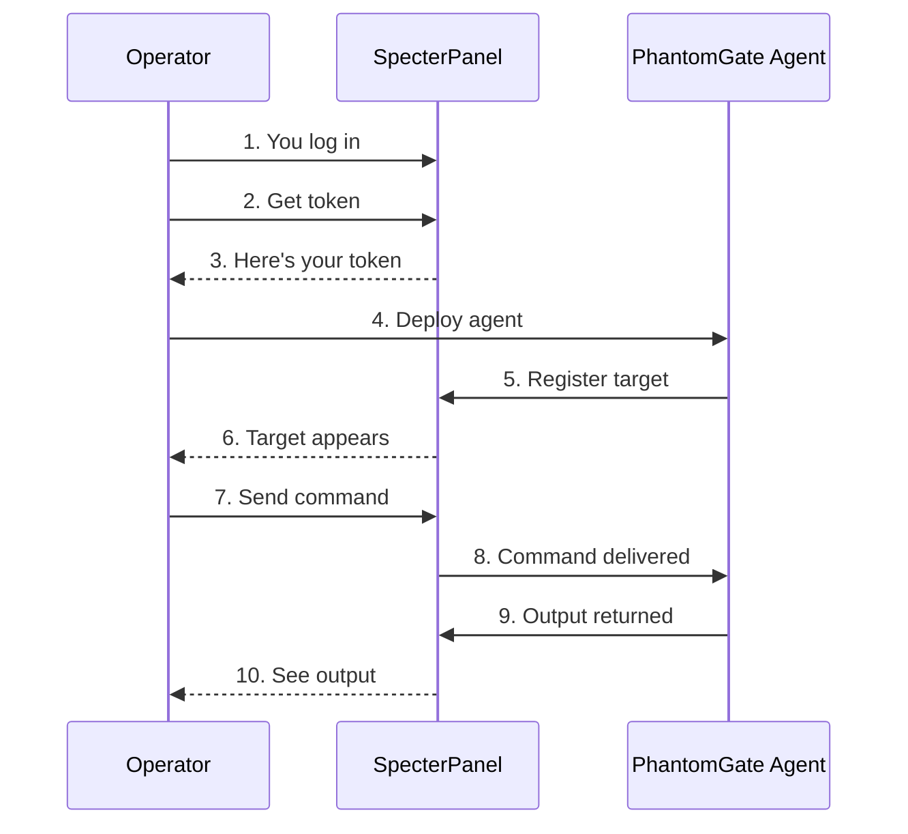

# SpecterPanel

<p align="center">
  
</p>

---

## Wait. What Is This Again?

Oh right. It's a C2 panel. I built one. Because reasons.

Look, I know there are like a million of these already. But this one is mine. I made it. It does things. Some of them are even intentional.

If you're here, you probably already know what a C2 is. If you don't... well, buckle up. It's gonna be a ride.

---

## The Rules (Because Apparently We Need These)

Don't be dumb. That's it. That's the rule.

If you use this on systems that aren't yours, that's your problem. Not mine. I don't know you. I don't know where you live. I'm not your character witness.

"I didn't know it was illegal" isn't going to work. You know. I know you know. Let's not pretend.

---

## What's All This Then?

**Dashboard** – It shows you things. Agents. Numbers. Stuff that makes you feel important.

**Terminal** – Type commands. Watch things happen. Feel like you're in a movie.

**Code Injection** – AI writes Python for you. Because typing is hard.

**Botnet Manager** – Track your agents. Like a shepherd. But for computers.

**API Gateway** – Encrypted everything. Because sending secrets in plain text is embarrassing.

**Database** – Stores... things. Important things. Boring things. All the things.

---

## The Fancy GUI Thing

Some people don't like terminals. I know. It's weird. But they exist.

So I made a GUI. With buttons. And colors. And all that stuff.

[PhontomGate Flet App](https://github.com/omerKkemal/flet-apps/tree/main/PhontomGate)

It does the same thing. Just with a pretty face.

---

## How It All Works


```mermaid
sequenceDiagram
    
    Operator ->> SpecterPanel: 1. You log in
    Operator ->> SpecterPanel: 2. Get token
    SpecterPanel -->> Operator: 3. Here's your token
    Operator ->> PhantomGate Agent: 4. Deploy agent
    PhantomGate Agent ->> SpecterPanel: 5. Register target
    SpecterPanel -->> Operator: 6. Target appears
    Operator ->> SpecterPanel: 7. Send command
    SpecterPanel ->> PhantomGate Agent: 8. Command delivered
    PhantomGate Agent ->> SpecterPanel: 9. Output returned
    SpecterPanel -->> Operator: 10. See output
```

---

## The Files And Folders

```
SPECTERPANEL/
├── api/             # The talking part
├── db/              # The remembering part
├── event/           # The oops part
├── log/             # The paper trail part
├── static/          # The pretty part
├── utility/         # The helpful part
├── view/            # The actual part
├── templates/       # The HTML part
├── screen_shot/     # The picture part
├── app.py           # The starting part
├── initial_db.py    # The setup part
└── requirements.txt # The dependency part
```

---

## How To Make It Work

```bash
git clone https://github.com/omerKkemal/oh-tool-v2.git
cd oh-tool-v2

python3 -m venv venv
source venv/bin/activate

pip install -r requirements.txt

# Edit setting.py. Set the encryption key. Seriously. Do it.

python initial_db.py

flask run --host=0.0.0.0 --port=5000
```

Then visit `http://localhost:5000`. Login with the credentials from the console.

---

## The API Stuff

| Method | Endpoint | What It's For |
|--------|----------|---------------|
| GET | `/api/v1.2/ApiCommand/<target>` | Get commands |
| POST | `/api/v1.2/Apicommand/save_output` | Send output |
| GET | `/api/v1.2/BotNet/<target>` | Get bot instructions |
| POST | `/api/v1.2/registor_target` | Register target |
| GET | `/api/v1.2/get_instraction/<target>` | Get instructions |
| GET | `/api/v1.2/injection/lib/<target>` | Download payload |
| POST | `/api/v1.2/injection/code_output_save/<target>` | Save output |

All encrypted. Because we care about your secrets.

---

## The Three Musketeers

| Project | What It Is |
|---------|------------|
| SpecterPanel | The C2 |
| PhantomGate | The Agent |
| PhontomGate GUI | The Pretty One |

---

## Look At These Pictures

<div align="center">

**Dashboard** – Look. Things.  


**Terminal** – Type. See.  


**Code Injection** – AI magic.  


**BotNet Manager** – Agents everywhere.  


**Settings** – Change things.  


**Login** – Get in here.  


**Home** – Start here.  


</div>

---

## Who Is Responsible For This

Omer Kemal. That's who.

Developer. Security person. Coffee enthusiast.

- [SpecterPanel](https://github.com/omerKkemal/oh-tool-v2)
- [PhantomGate](https://github.com/omerKkemal/PhontomGate)
- [PhontomGate GUI](https://github.com/omerKkemal/flet-apps/tree/main/PhontomGate)

---

## The Legal Bit

It's mine. Don't steal it. Don't misuse it. Be nice.

---

<p align="center">
  <sub>Built with effort. Supported by caffeine. Maintained by hope.</sub>
</p>
