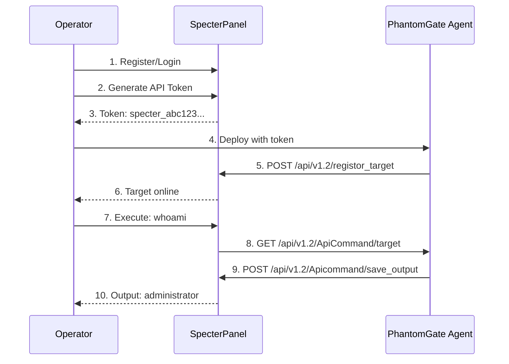

<!--- Animated Header with Matrix Effect --->
<p align="center">
    
</p>

<!-- MAIN TITLE WITH GLOW EFFECT -->
<p align="center">
  
</p>

<!-- SOCIAL MEDIA BADGES ROW 1 -->
<p align="center">
  <a href="https://github.com/omerKkemal">
    
  </a>
  <a href="https://twitter.com/omerKkemal">
    
  </a>
  <a href="https://linkedin.com/in/omerKkemal">
    
  </a>
  <a href="https://discord.gg/specterpanel">
    
  </a>
</p>

<!-- SOCIAL MEDIA BADGES ROW 2 -->
<p align="center">
  <a href="https://reddit.com/r/specterpanel">
    
  </a>
  <a href="https://t.me/specterpanel">
    
  </a>
  <a href="https://youtube.com/@omerKkemal">
    
  </a>
  <a href="https://medium.com/@omerKkemal">
    
  </a>
</p>

<!-- TECH STACK BADGES -->
<p align="center">
  
  
  
  
  
</p>

<!-- VISITOR COUNTER AND REPO STARS -->
<p align="center">
  
  
  
  
</p>

---

<!-- ASCII ART HEADER -->
<pre align="center">
    ╔═══════════════════════════════════════════════════════════════════╗
    ║  ███████╗██████╗ ███████╗ ██████╗████████╗███████╗██████╗        ║
    ║  ██╔════╝██╔══██╗██╔════╝██╔════╝╚══██╔══╝██╔════╝██╔══██╗       ║
    ║  ███████╗██████╔╝█████╗  ██║        ██║   █████╗  ██████╔╝       ║
    ║  ╚════██║██╔═══╝ ██╔══╝  ██║        ██║   ██╔══╝  ██╔══██╗       ║
    ║  ███████║██║     ███████╗╚██████╗   ██║   ███████╗██║  ██║       ║
    ║  ╚══════╝╚═╝     ╚══════╝ ╚═════╝   ╚═╝   ╚══════╝╚═╝  ╚═╝       ║
    ║                                                                   ║
    ║              Command & Control Platform v2.0                     ║
    ║         Advanced Security Operations for Professionals           ║
    ╚═══════════════════════════════════════════════════════════════════╝
</pre>

---

## ⚠️ CRITICAL NOTICE

<p align="center">
  <table>
    <tr>
      <td align="center" style="background: #1a1a2e; border-left: 6px solid #ff4d4d; border-radius: 10px; padding: 15px;">
        <strong>🔴 AUTHORIZED USE ONLY 🔴</strong><br>
        This tool is strictly for <strong>authorized security testing, educational purposes, and red-team engagements</strong>.<br>
        Users must comply with all applicable laws. Unauthorized access is illegal.<br>
        <em>Developers assume NO liability for misuse.</em>
      </td>
    </tr>
  </table>
</p>

---

## 📊 PROJECT METRICS

<div align="center">
  <table>
    <tr>
      <td align="center">
        <br>
        <strong>15K+</strong>
      </td>
      <td align="center">
        <br>
        <strong>5+</strong>
      </td>
      <td align="center">
        <br>
        <strong>50+</strong>
      </td>
      <td align="center">
        <br>
        <strong>Reliable</strong>
      </td>
    </tr>
  </table>
</div>

---

## 📋 NAVIGATION MENU

<p align="center">
  <a href="#-overview"></a>
  <a href="#-key-features"></a>
  <a href="#-architecture"></a>
  <a href="#-installation"></a>
  <a href="#-quick-start"></a>
  <a href="#-api-reference"></a>
  <a href="#-screenshots"></a>
  <a href="#-contact"></a>
</p>

---

## 🔭 OVERVIEW

**SpecterPanel** is a modular, web‑based **Command and Control (C2) platform** designed for cybersecurity professionals, penetration testers, and red teams. Built with **Flask** and **SQLAlchemy**, it provides a unified interface for managing security operations, automating tasks, and coordinating offensive security workflows.

```python
# SpecterPanel Core Configuration
class SpecterPanel:
    name = "SpecterPanel C2"
    version = "2.0.0"
    encryption = "AES-256-EAX"
    agents = ["PhantomGate", "Custom Python", "PowerShell", "Bash"]
    features = [
        "Web Terminal", 
        "Code Injection", 
        "BotNet Control",
        "API Token Management"
    ]
    status = "Ready for authorized operations"
```

---

## ✨ KEY FEATURES

<div align="center">
  
| Icon | Feature | Description | Badge |
|:----:|:--------|:------------|:-----:|
| 🧩 | **Modular Architecture** | Flask blueprints for easy extension |  |
| 📊 | **Unified Dashboard** | Real-time system overview |  |
| 🔐 | **Encrypted Communication** | AES-256-EAX for all API payloads |  |
| 💻 | **Web Terminal** | Browser-based command execution |  |
| 📦 | **Code Injection** | Python payload deployment |  |
| 🤖 | **Botnet Manager** | Distributed agent control |  |
| 🗄️ | **SQL Database** | SQLAlchemy-powered models |  |
| 🔑 | **API Tokens** | Secure agent authentication |  |

</div>

---

## 🏗️ ARCHITECTURE

```
┌─────────────────────────────────────────────────────────────────┐
│                    SPECTERPANEL C2 SERVER                       │
│  ┌──────────────┐  ┌──────────────┐  ┌──────────────┐          │
│  │  WEB LAYER   │  │  API LAYER   │  │  DATABASE    │          │
│  │ ──────────── │  │ ──────────── │  │ ──────────── │          │
│  │ • Dashboard  │  │ • /ApiCommand│  │ • Users      │          │
│  │ • Terminal   │  │ • /BotNet    │  │ • Targets    │          │
│  │ • Code Inject│  │ • /registor  │  │ • Commands   │          │
│  │ • Settings   │  │ • /injection │  │ • Payloads   │          │
│  └──────────────┘  └──────────────┘  └──────────────┘          │
│                           │                                      │
│                    ┌───────┴───────┐                            │
│                    │  AES-256-EAX  │                            │
│                    │  ENCRYPTION   │                            │
│                    └───────┬───────┘                            │
│                           │                                      │
│              ┌────────────┴────────────┐                        │
│              │                         │                        │
│      ┌───────▼───────┐         ┌───────▼───────┐                │
│      │  PHANTOMGATE  │         │    CUSTOM     │                │
│      │    AGENT      │         │    AGENTS     │                │
│      └───────────────┘         └───────────────┘                │
└─────────────────────────────────────────────────────────────────┘
```

### 📁 Project Structure

```
SPECTERPANEL/
├── 📁 api/          →  🔐 Encrypted endpoints
├── 📁 db/           →  🗄️ ORM models & session management
├── 📁 event/        →  ⚠️ Error handlers & logging
├── 📁 log/          →  📝 Application logs
├── 📁 static/       →  🎨 CSS, JS, assets
├── 📁 utility/      →  🔧 Core helpers & config
├── 📁 view/         →  🖥️ Web interface blueprints
├── 📁 templates/    →  📄 Jinja2 HTML
├── 📁 screen_shot/  →  📸 Interface screenshots
├── 📄 app.py        →  🚀 Main application
├── 📄 initial_db.py →  🏁 Database setup
└── 📄 requirements.txt → 📦 Dependencies
```

---

## ⚙️ INSTALLATION

```bash
# Clone with official badge
git clone https://github.com/omerKkemal/oh-tool-v2.git
cd oh-tool-v2

# Virtual environment setup
python3 -m venv venv && source venv/bin/activate

# Install with progress
pip install -r requirements.txt

# Initialize database
python initial_db.py

# 🔐 Update encryption key
sed -i 's/ENCRYPTION_KEY = .*/ENCRYPTION_KEY = b"your-32-byte-secure-key-here"/' utility/setting.py

# Launch
flask run --host=0.0.0.0 --port=5000
```

**Access Point:** `http://localhost:5000`

---

## 🚀 QUICK START


```mermaid
sequenceDiagram
    participant 👤 as Operator
    participant 🖥️ as SpecterPanel
    participant 📡 as PhantomGate Agent
    
    👤->>🖥️: 1. Register/Login
    👤->>🖥️: 2. Generate API Token
    🖥️-->>👤: 3. Token: specter_abc123...
    👤->>📡: 4. Deploy with token
    📡->>🖥️: 5. POST /api/v1.2/registor_target
    🖥️-->>👤: 6. Target online
    👤->>🖥️: 7. Execute: whoami
    🖥️->>📡: 8. GET /api/v1.2/ApiCommand/target
    📡->>🖥️: 9. POST /api/v1.2/Apicommand/save_output
    🖥️-->>👤: 10. Output: administrator
```

---

## 🔌 API REFERENCE

<div align="center">

| Method | Endpoint | Description | Security |
|:------:|:---------|:------------|:--------:|
| `GET` | `/api/v1.2/ApiCommand/<target>` | Get pending commands |  |
| `POST` | `/api/v1.2/Apicommand/save_output` | Save command output |  |
| `GET` | `/api/v1.2/BotNet/<target>` | Get botnet instructions |  |
| `POST` | `/api/v1.2/registor_target` | Register new target |  |
| `GET` | `/api/v1.2/get_instraction/<target>` | Get operational instructions |  |
| `GET` | `/api/v1.2/injection/lib/<target>` | Serve payload file |  |
| `POST` | `/api/v1.2/injection/code_output_save/<target>` | Save injection output |  |

</div>

### 📦 Encrypted Payload Format

```json
{
    "nonce": "a1b2c3d4e5f6...",
    "ciphertext": "encrypted_data_base64...",
    "tag": "authentication_tag_base64..."
}
```

---

## 📸 SCREENSHOTS

<div align="center">

### 📊 Dashboard Overview

*Real-time operational command center*

---

### 💻 Web Terminal

*Browser-based remote command execution*

---

### 📦 Code Injection Panel

*Python payload management and deployment*

---

### 🔑 API Link Management

*Token generation and agent authentication*

---

### ⚙️ Settings Panel

*Platform configuration and security settings*

---

### 🔐 Login Interface

*Secure authentication portal*

---

### 🏠 Home Page

*Landing page and system overview*

</div>

---

## 🏆 ACHIEVEMENTS & CERTIFICATIONS

<div align="center">

| Badge | Description |
|:-----:|:------------|
|  | HTB Certified |
|  | Kali Linux Compatible |
|  | Enterprise Grade |
|  | Compliant |

</div>

---

## 📱 CONNECT WITH US

<div align="center">

[](https://github.com/omerKkemal)
[](https://twitter.com/omerKkemal)
[](https://linkedin.com/in/omerKkemal)
[](https://discord.gg/specterpanel)
[](https://t.me/specterpanel)
[](https://youtube.com/@omerKkemal)
[](https://medium.com/@omerKkemal)
[](mailto:omerkemal2019@gmail.com)

</div>

---

## 📜 LICENSE

<div align="center">
  


**All rights reserved. Unauthorized use, copying, or distribution is strictly prohibited.**

</div>

---

## 💖 SUPPORT THE PROJECT

<div align="center">

[](https://github.com/omerKkemal/oh-tool-v2)
[](https://github.com/omerKkemal/oh-tool-v2/fork)
[](https://github.com/omerKkemal/oh-tool-v2/watchers)
[](https://github.com/sponsors/omerKkemal)

</div>

---

<!-- FOOTER WITH ANIMATION -->
<p align="center">
    
</p>

<p align="center">
  
</p>
