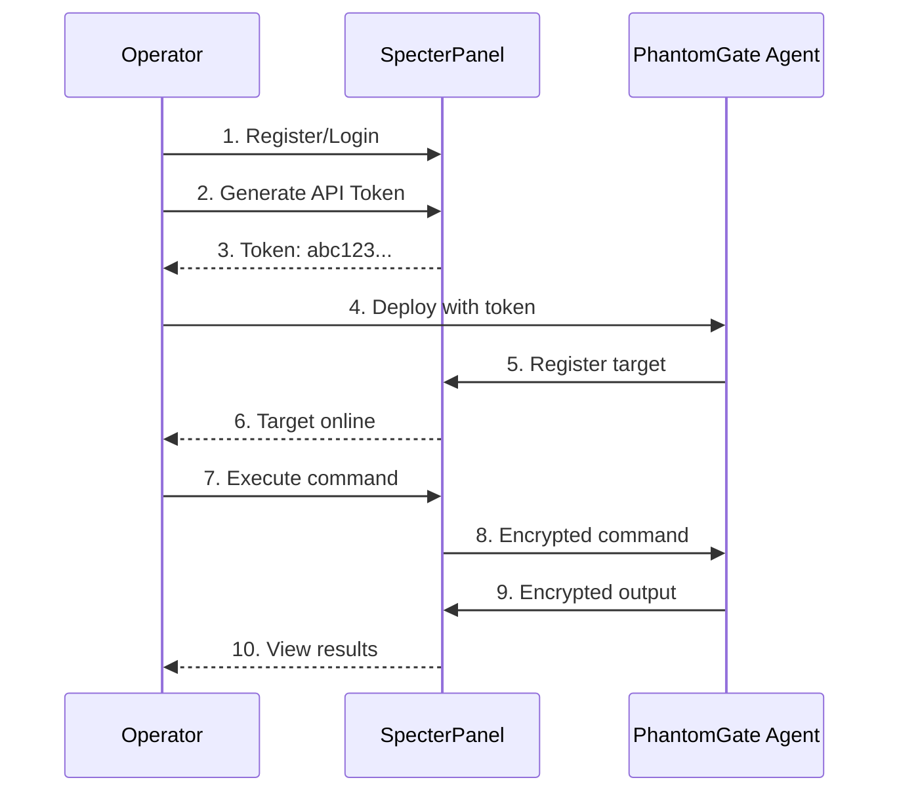

<!--- Animated Header --->
<p align="center">
    
</p>

<p align="center">
  
  <br>
  <strong>Advanced Command & Control (C2) Platform for Security Professionals</strong>
</p>

<div align="center">
  <table>
    <tr>
      <td></td>
      <td></td>
      <td></td>
      <td></td>
      <td></td>
    </tr>
  </table>
</div>

---

<!-- TERMINAL-STYLE HEADER -->
<pre align="center">
╔═══════════════════════════════════════════════════════════════════╗
║                    SPECTERPANEL C2 PLATFORM                       ║
║              Advanced Command & Control for Security Pros         ║
╚═══════════════════════════════════════════════════════════════════╝
</pre>

---

## ⚠️ LEGAL DISCLAIMER

```diff
+ 🔴 IMPORTANT - READ BEFORE PROCEEDING +
! This tool is STRICTLY for authorized security testing and educational purposes only.
! Unauthorized access to computer systems is ILLEGAL.
! Users must comply with all applicable local, state, and federal laws.
! The developers assume NO liability for misuse or damages.
```

---

## 📋 QUICK NAVIGATION

<p align="center">
  <a href="#-overview"><b>Overview</b></a> •
  <a href="#-key-features"><b>Features</b></a> •
  <a href="#-architecture"><b>Architecture</b></a> •
  <a href="#-installation"><b>Installation</b></a> •
  <a href="#-quick-start"><b>Quick Start</b></a> •
  <a href="#-interface-preview"><b>Interface</b></a> •
  <a href="#-api-reference"><b>API</b></a> •
  <a href="#-contact"><b>Contact</b></a>
</p>

---

## 🔭 OVERVIEW

**SpecterPanel** is a modular, web‑based **Command and Control (C2) platform** designed for cybersecurity professionals, penetration testers, and red teams. Built with **Flask** and **SQLAlchemy**, it provides a unified interface for managing security operations, automating tasks, and coordinating offensive security workflows.

```python
# SpecterPanel in a nutshell
class SpecterPanel:
    def __init__(self):
        self.encryption = "AES-256-EAX"
        self.agents = ["PhantomGate", "Custom"]
        self.features = ["Web Terminal", "Code Injection", "BotNet Control"]
        self.status = "Ready for authorized operations"
```

---

## ✨ KEY FEATURES

<details open>
<summary><b>Click to expand feature list</b></summary>
<br>

| 🧩 | **Modular Architecture** | Easily extend with Flask blueprints |
|:--:|:-------------------------|:-----------------------------------|
| 📊 | **Unified Dashboard** | Real-time overview of all platform activities |
| 🔐 | **Encrypted Communication** | AES-256-EAX for all API payloads |
| 💻 | **Web Terminal** | Browser-based command execution on remote targets |
| 📦 | **Code Injection Panel** | Upload and deploy Python payloads |
| 🤖 | **Botnet Manager** | Orchestrate distributed agent tasks |
| 🗄️ | **SQL Database** | SQLAlchemy-powered data models |
| 🔑 | **API Token Management** | Generate and revoke agent tokens |
| 📝 | **Instruction System** | Per-target operational tasking |
| 🌐 | **Socket Management** | Persistent communication channels |

</details>

---

## 🏗️ ARCHITECTURE

```
┌────────────────────────────────────────────────────────────────┐
│                        SPECTERPANEL C2                         │
├────────────────────────────────────────────────────────────────┤
│                                                                │
│    ┌──────────────┐    ┌──────────────┐    ┌──────────────┐    │
│    │   WEB LAYER  │    │   API LAYER  │    │  DATABASE    │    │
│    │  (Flask)     │    │  (AES-256)   │    │ (SQLAlchemy) │    │
│    ├──────────────┤    ├──────────────┤    ├──────────────┤    │
│    │ • Dashboard  │    │ • /ApiCommand│    │ • Users      │    │
│    │ • Terminal   │    │ • /BotNet    │    │ • Targets    │    │
│    │ • Code Inject│    │ • /registor  │    │ • Commands   │    │
│    │ • Settings   │    │ • /injection │    │ • Payloads   │    │
│    └──────────────┘    └──────────────┘    └──────────────┘    │
│                           │                                    │
│                    Encrypted Channel                           │
│                           │                                    │
│              ┌────────────┴────────────┐                       │
│              │                         │                       │
│      ┌───────▼───────┐         ┌───────▼───────┐               │
│      │ PhantomGate   │         │ Custom        │               │
│      │ Agent         │         │ Agents        │               │
│      └───────────────┘         └───────────────┘               │
│                                                                │
└────────────────────────────────────────────────────────────────┘
```

### 📁 Project Tree

```
SPECTERPANEL/
├── 📂 api/                 # Encrypted API endpoints
├── 📂 db/                  # Database ORM and models
├── 📂 event/               # Error handlers & logging
├── 📂 log/                 # Application logs
├── 📂 static/              # CSS, JS, payload files
├── 📂 utility/             # Core helpers & config
├── 📂 view/                # Web interface blueprints
├── 📂 templates/           # Jinja2 HTML templates
├── 📂 screen_shot/         # Interface screenshots
├── 📄 app.py               # Main Flask application
├── 📄 initial_db.py        # Database setup
└── 📄 requirements.txt     # Dependencies
```

---

## ⚙️ INSTALLATION

```bash
# 1. Clone the repository
$ git clone https://github.com/omerKkemal/oh-tool-v2.git
$ cd oh-tool-v2

# 2. Create virtual environment
$ python3 -m venv venv
$ source venv/bin/activate  # Windows: venv\Scripts\activate

# 3. Install dependencies
$ pip install -r requirements.txt

# 4. Initialize database
$ python initial_db.py

# 5. 🔐 Update encryption key in utility/setting.py
$ nano utility/setting.py  # Set ENCRYPTION_KEY = b'your-32-byte-key'

# 6. Launch SpecterPanel
$ flask run

# Server will start at http://127.0.0.1:5000
```

---

## 🚀 QUICK START


```mermaid
sequenceDiagram
    participant Operator
    participant C2 as SpecterPanel
    participant Agent as PhantomGate Agent
    
    Operator->>C2: 1. Register/Login
    Operator->>C2: 2. Generate API Token
    C2-->>Operator: 3. Token: abc123...
    Operator->>Agent: 4. Deploy with token
    Agent->>C2: 5. Register target
    C2-->>Operator: 6. Target online
    Operator->>C2: 7. Execute command
    C2->>Agent: 8. Encrypted command
    Agent->>C2: 9. Encrypted output
    C2-->>Operator: 10. View results
```

---

## 🖥️ INTERFACE PREVIEW

Since screenshots are stored locally, here's what you'll see in the `/screen_shot` directory:

<details open>
<summary><b>📊 DASHBOARD (dashbord.png)</b></summary>

```
┌─────────────────────────────────────────────────────────────────┐
│ SPECTERPANEL C2                         USER: admin             │
├─────────────────────────────────────────────────────────────────┤
│ ┌─────────────┐  ┌─────────────┐  ┌─────────────┐               │
│ │ TARGETS     │  │ COMMANDS    │  │ PAYLOADS    │               │
│ │     12      │  │     156     │  │     8       │               │
│ │ Online: 8   │  │ Pending: 23 │  │ Active: 3   │               │
│ └─────────────┘  └─────────────┘  └─────────────┘               │
│                                                                 │
│ TARGET LIST:                           ACTIVITY FEED:           │
│ ┌──────────────────┐                   ┌──────────────────┐     │
│ │ ✔ workstation-01 │                   │ 14:32 - Command  │     │
│ │   Windows 10     │                   │       executed   │     │
│ │   ● Online       │                   │ 14:28 - New      │     │
│ │                  │                   │       target reg │     │
│ │ ✔ server-02      │                   │ 14:15 - Payload  │     │
│ │   Ubuntu 22.04   │                   │       uploaded   │     │
│ │   ● Online       │                   └──────────────────┘     │
│ │                  │                                            │
│ │ ○ laptop-05      │                   QUICK COMMAND:           │
│ │   macOS          │                   > whoami              [↲]│
│ │   ○ Offline      │                                            │
│ └──────────────────┘                                            │
└─────────────────────────────────────────────────────────────────┘
```
</details>

<details>
<summary><b>💻 WEB TERMINAL (webTerminal.png)</b></summary>

```
┌─────────────────────────────────────────────────────────────────┐
│ WEB TERMINAL › workstation-01                                   │
├─────────────────────────────────────────────────────────────────┤
│                                                                 │
│ [user@workstation ~]$ whoami                                    │
│ administrator                                                   │
│                                                                 │
│ [user@workstation ~]$ ipconfig                                  │
│ Ethernet adapter Ethernet0:                                     │
│    IPv4 Address: 192.168.1.105                                  │
│    Subnet Mask: 255.255.255.0                                   │
│    Default Gateway: 192.168.1.1                                 │
│                                                                 │
│ [user@workstation ~]$ netstat -an | find "EST"                  │
│  TCP  192.168.1.105:49582  10.0.0.25:443  ESTABLISHED           │
│  TCP  192.168.1.105:49583  10.0.0.25:443  ESTABLISHED           │
│                                                                 │
│ > _                                                             │
└─────────────────────────────────────────────────────────────────┘
```
</details>

<details>
<summary><b>📦 CODE INJECTION (code_ground.png)</b></summary>

```
┌─────────────────────────────────────────────────────────────────┐
│ CODE INJECTION PANEL                                            │
├─────────────────────────────────────────────────────────────────┤
│                                                                 │
│ AVAILABLE PAYLOADS:                                             │
│ ┌─────────────────────────────────────────────────────────────┐ │
│ │ ✔ keylogger.py           [INJECT] [DELETE] [DOWNLOAD]       │ │
│ │   Size: 2.4 KB  |  Uploaded: 2024-01-15                     │ │
│ ├─────────────────────────────────────────────────────────────┤ │
│ │ ✔ screenshot.py          [INJECT] [DELETE] [DOWNLOAD]       │ │
│ │   Size: 1.8 KB  |  Uploaded: 2024-01-20                     │ │
│ ├─────────────────────────────────────────────────────────────┤ │
│ │ ✔ persistence.py         [INJECT] [DELETE] [DOWNLOAD]       │ │
│ │   Size: 3.1 KB  |  Uploaded: 2024-01-25                     │ │
│ └─────────────────────────────────────────────────────────────┘ │
│                                                                 │
│ UPLOAD NEW PAYLOAD:                                             │
│ [📎 Choose File] keylogger_v2.py  [⬆ UPLOAD]                    │
│                                                                 │
│ RECENT OUTPUT:                                                  │
│ [14:32] workstation-01 › Screenshot saved to C:\temp\scrn.png   │
│ [14:15] server-02 › Keylogger started (PID 1234)                │
└─────────────────────────────────────────────────────────────────┘
```
</details>

<details>
<summary><b>🔑 API TOKEN MANAGEMENT (api_link.png)</b></summary>

```
┌─────────────────────────────────────────────────────────────────┐
│ API TOKEN MANAGEMENT                                            │
├─────────────────────────────────────────────────────────────────┤
│                                                                 │
│ ACTIVE TOKENS:                                                  │
│ ┌─────────────────────────────────────────────────────────────┐ │
│ │ Token: prod-agent-01 •••••••••••••••••••                    │ │
│ │ Created: 2024-01-15  |  Expires: 2024-02-15                 │ │
│ │ Last Used: 2024-01-28 14:32  |  Status: ● Active            │ │
│ │ [REVOKE] [EXTEND]                                           │ │
│ ├─────────────────────────────────────────────────────────────┤ │
│ │ Token: dev-testing    •••••••••••••••••••                   │ │
│ │ Created: 2024-01-20  |  Expires: Never                      │ │
│ │ Last Used: 2024-01-27 09:15  |  Status: ● Active            │ │
│ │ [REVOKE]                                                    │ │
│ └─────────────────────────────────────────────────────────────┘ │
│                                                                 │
│ GENERATE NEW TOKEN:                                             │
│ Token Name: [agent-prod-03______________]                       │
│ Expiration: [30 days        ▼]                                  │
│ Permissions: ☑ Command  ☑ File  ☐ BotNet  ☑ Injection           │
│                                                  [GENERATE]     │
└─────────────────────────────────────────────────────────────────┘
```
</details>

<details>
<summary><b>⚙️ SETTINGS (setting.png)</b></summary>

```
┌─────────────────────────────────────────────────────────────────┐
│ SYSTEM SETTINGS                                                 │
├─────────────────────────────────────────────────────────────────┤
│                                                                 │
│ SECURITY:                                                       │
│   Encryption Key: [••••••••••••••••••••••••] [ROTATE]           │
│   Session Timeout: [30] minutes                                 │
│   2FA Enabled:     [✓] Yes  [ ] No                              │
│                                                                 │
│ DATABASE:                                                       │
│   Path: ./db/info.json                                          │
│   Size: 2.3 MB                                                  │
│   Backups: [CREATE BACKUP] [RESTORE]                            │
│                                                                 │
│ LOGGING:                                                        │
│   Log Level: [INFO        ▼]                                    │
│   Max Log Size: [10] MB                                         │
│   Log Retention: [30] days                                      │
│                                                                 │
│ NETWORK:                                                        │
│   Bind Address: 0.0.0.0                                         │
│   Port: 5000                                                    │
│   SSL: [UPLOAD CERT]                                            │
│                                                                 │
│                                            [SAVE] [DEFAULTS]    │
└─────────────────────────────────────────────────────────────────┘
```
</details>

<details>
<summary><b>🔐 LOGIN (login.png)</b></summary>

```
┌─────────────────────────────────────┐
│        SPECTERPANEL C2              │
│                                     │
│           🔐 LOGIN                  │
│                                     │
│    ┌─────────────────────┐          │
│    │ admin@example.com   │          │
│    └─────────────────────┘          │
│                                     │
│    ┌─────────────────────┐          │
│    │ ••••••••••••••••••  │          │
│    └─────────────────────┘          │
│                                     │
│        [🔓 LOGIN]                   │
│                                     │
│    Need an account? Register        │
│    Forgot password? Reset           │
│                                     │
│    ⚠️ AUTHORIZED USE ONLY           │
└─────────────────────────────────────┘
```
</details>

> **Note:** Actual screenshots are available in the `/screen_shot` directory of the repository.

---

## 🔌 API REFERENCE

All endpoints use **AES-256-EAX encryption** with the following envelope:

```json
{
    "nonce": "base64_encoded_nonce",
    "ciphertext": "base64_encoded_ciphertext",
    "tag": "base64_encoded_tag"
}
```

| Method | Endpoint | Description |
|:-------|:---------|:------------|
| `GET` | `/api/v1.2/ApiCommand/<target>` | Get pending commands |
| `POST` | `/api/v1.2/Apicommand/save_output` | Save command output |
| `GET` | `/api/v1.2/BotNet/<target>` | Get botnet instructions |
| `POST` | `/api/v1.2/registor_target` | Register new target |
| `GET` | `/api/v1.2/get_instraction/<target>` | Get operational instructions |
| `GET` | `/api/v1.2/injection/lib/<target>` | Serve payload file |
| `POST` | `/api/v1.2/injection/code_output_save/<target>` | Save injection output |

---

## 📜 LICENSE

**Proprietary License** © 2024 Omer Kemal

All rights reserved. Unauthorized use, copying, modification, or distribution is strictly prohibited.

For licensing inquiries: 📧 omerkemal2019@gmail.com

---

## 📬 CONTACT

<div align="center">
  <table>
    <tr>
      <td align="center"><b>👤 Author</b></td>
      <td align="center"><b>📧 Email</b></td>
      <td align="center"><b>🐙 GitHub</b></td>
      <td align="center"><b>📁 Repository</b></td>
    </tr>
    <tr>
      <td align="center">Omer Kemal</td>
      <td align="center"><a href="mailto:omerkemal2019@gmail.com">omerkemal2019@gmail.com</a></td>
      <td align="center"><a href="https://github.com/omerKkemal">@omerKkemal</a></td>
      <td align="center"><a href="https://github.com/omerKkemal/oh-tool-v2">oh-tool-v2</a></td>
    </tr>
  </table>
</div>

---

<pre align="center">
╔═══════════════════════════════════════════════════════════════════╗
║     Built with 🔥 by Omer Kemal for the security community       ║
║                    AUTHORIZED USE ONLY                            ║
║                    © 2024 SpecterPanel                            ║
╚═══════════════════════════════════════════════════════════════════╝
</pre>
