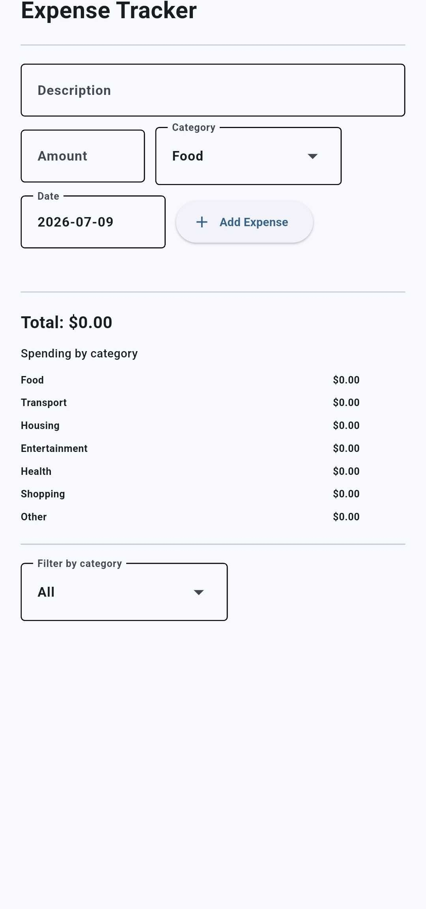
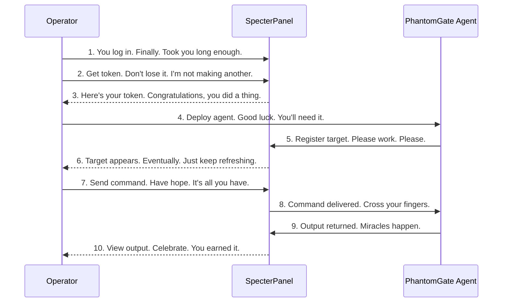

# SpecterPanel

<p align="center">
  
</p>

---

## Behold. My Masterpiece.

I spent countless sleepless nights crafting this beautiful disaster.  
Blood, sweat, tears, and approximately 47 cups of coffee went into making this C2 panel.  
You're welcome. Or I'm sorry. Honestly, I can't tell anymore.

---

---

## The Fine Print (Read It Or Don't, I'm Not Your Mom)

Look. I know you're probably not reading this. You're scrolling past it like it's a terms of service agreement for a social media app. But just in case:

This is for **authorised testing**. Not for "testing" your ex's Wi-Fi. Not for "testing" your neighbor's smart fridge. Not for "testing" whether the government is actually watching you (spoiler: they probably are, but that's not my fault).

If you use this on random people's computers, that's your problem. I'm not your lawyer. I'm not your alibi. I'm not even sure I'm a real person at this point – I've been staring at code for so long I think I might be a hallucination.

"I didn't know" won't work. You know. I know you know. Don't play dumb. You're better than that. Probably.

**If you get caught, you didn't get this from me. I was never here. This README is a figment of your imagination.**

---


## The Trojan Horse – Behold Its Terrible Beauty

Look upon my works, ye mighty, and despair.

Yes. There's a GUI. Real hackers use terminals. But some people like buttons. And colors. So I gave them what they wanted. A beautiful, seductive, utterly terrifying interface.

**Behold:** [PhontomGate Flet App](https://github.com/omerKkemal/flet-apps/tree/main/PhontomGate)

<p align="center">
  
</p>

*"What a lovely expense tracker!"* – Someone who is about to have a very bad day

It looks so innocent. So helpful. So... corporate. Like something you'd install on your work computer to track lunch expenses. The colors are calming. The layout is professional. It practically screams "legitimate business application."

**That's the horror.**

### The Beauty That Beckons:

- **Elegance incarnate** – It's pretty. Really pretty. Almost too pretty. Like a flower that eats insects.
- **Seductive simplicity** – Anyone can use it. Grandma could use it. That's the trap. Grandma shouldn't be using this.
- **Cross-platform nightmare fuel** – Windows. Linux. Android. It follows you like that ex you can't get rid of.
- **The perfect disguise** – It pretends to track expenses. It's tracking your life choices. And your browsing history. And your snack preferences.

### The Horror That Lurks:

- **It connects to a C2 server** – That button you just clicked for "fun"? Yeah. That registered a target. You're not having fun. You're being productive. Accidentally.
- **It spreads like a plague** – Build it as APK, EXE, web app. Hand it to a friend. Watch it propagate. Like a meme. But less funny and more illegal.
- **It pretends to be your friend** – It smiles. It waves. It asks about your day. It's not your friend. It's a digital wolf in sheep's clothing. With a spreadsheet.
- **That expense tracker?** – Yeah. That's tracking your expenses. All of them. Including the ones you forgot about. Including the ones you didn't even know you had.

**"What a lovely expense tracker!"** – You, 5 seconds before you realize it's tracking you. And your cat. And your neighbor's Wi-Fi.

**The beauty makes you lower your guard. The horror makes you question why you downloaded this in the first place.**

*You didn't find it. It found you.*  
*And it's absolutely stunning. Like a car crash. You can't look away.*

---

## What's In This Beautiful Disaster

- **Dashboard** – Look at your agents. Pretend you're in control. You're not. But it's fun. Like playing Sims. But with actual consequences.
- **Terminal** – Type words. Watch things happen. Feel powerful. It's a good feeling. Until you type something wrong and break the internet. Then it's a learning experience.
- **Code Injection** – Write your own payloads. Or let the AI do it for you. Or both. The power is yours. The chaos is inevitable. Like a toddler with a flamethrower.
- **BotNet Manager** – Tell your agents what to do. They do the dirty work. You just point and click. Like a general. But with less uniform and more coffee. And less responsibility. Actually, no. All the responsibility.
- **API Gateway** – Encrypted. Because plaintext is for amateurs and people who enjoy getting caught. You're not an amateur. Right? Right?
- **SQLite DB** – Stores things. Important things. Boring things. All the things. Including the things you wish it didn't. Like your search history.

It's got everything you need and nothing you don't. Except my sarcasm. You're stuck with that. Like a permanent tattoo you regret.

---

## BotNet Manager – You Point. They Shoot.

This is where you tell your little digital minions what to do. Because apparently you have trust issues and can't do it yourself.

**UDP Flood** – Tell your agents to send packets. Lots of them. Like a million. At one target. At many targets. At all the targets. The agents do the heavy lifting. You just sit back. Press a button. Watch the chaos unfold. It's like watching fireworks. But with more sadness.

**Brute-Force** – Tell your agents to try passwords. Thousands of them. Millions of them. Until one works. Or until the target gives up. The agents do the work. You just wait. And hope. And maybe cry a little. It's like playing the lottery. But with less winning and more regret.

**Target One Agent** – Pick a specific agent. Give it a command. Watch it do things. Like a puppet master. But with more Python and less strings. Also less puppets. But more code.

**Broadcast to All Agents** – Send the same command to everyone. All at once. Like a group chat. But with more UDP packets and less memes. And more consequences. Definitely more consequences.

**Custom Chaos** – Write your own commands. Send them to your agents. Watch them execute. The world is your oyster. Or your botnet. Whatever you prefer. I'm not judging. Okay, I'm judging a little.

**The agents do everything.** – You just tell them what to do. They flood. They brute-force. They execute. They report back. Like a well-oiled machine. Or a slightly broken one. But hey, it's fun. Like a car that works 70% of the time. The other 30% is character building.

*"What a lovely expense tracker!"* – The agents, definitely not. They're too busy flooding things.

---

## Code Injection – The Real Fun Begins

So you want to inject code. Of course you do. Don't act like you don't.

**AI-generated code?** – Yes. Absolutely. The AI writes Python for you. You press a button. It gives you a payload. Like magic. But with more bugs. And sometimes it hallucinates. But hey, so do I after 47 cups of coffee.

**Write your own payload?** – Also yes. Because you're a real hacker. You don't need no stinking AI. You know what you're doing. You've got this. (You probably don't. But I believe in you. Like a proud parent. With lower expectations.)

**Inject it wherever you want** – Send it to your agents. Watch them execute it. Feel the power. Try not to break anything important. Like the internet. Or your career.

**But wait. There's more.** (I know, I sound like a late-night infomercial. I've accepted it.)

**Enhance your payload with AI.** – Yes. You heard me. You write something basic. The AI makes it better. Or worse. But probably better. Maybe. Look, just try it. It's fun. Like having a coding partner who never complains, doesn't steal your snacks, and silently judges you through the screen.

**The AI is here to help.** – It writes. It enhances. It judges you silently through the screen. But in a helpful way. Like a really passive-aggressive coworker.

*"What a lovely expense tracker!"* – The AI, definitely. It's learning from the best.

---

## How It All Works (Try To Keep Up)


```mermaid
sequenceDiagram
    
    Operator ->> SpecterPanel: 1. You log in. Finally. Took you long enough.
    Operator ->> SpecterPanel: 2. Get token. Don't lose it. I'm not making another.
    SpecterPanel -->> Operator: 3. Here's your token. Congratulations, you did a thing.
    Operator ->> PhantomGate Agent: 4. Deploy agent. Good luck. You'll need it.
    PhantomGate Agent ->> SpecterPanel: 5. Register target. Please work. Please.
    SpecterPanel -->> Operator: 6. Target appears. Eventually. Just keep refreshing.
    Operator ->> SpecterPanel: 7. Send command. Have hope. It's all you have.
    SpecterPanel ->> PhantomGate Agent: 8. Command delivered. Cross your fingers.
    PhantomGate Agent ->> SpecterPanel: 9. Output returned. Miracles happen.
    SpecterPanel -->> Operator: 10. View output. Celebrate. You earned it.
```

---

## The Folders No One Asked For

```
SPECTERPANEL/
├── api/             # The part that talks. Loudly.
├── db/              # Where data sleeps.
├── event/           # Where errors hang out.
├── log/             # Where errors go to die.
├── static/          # The pretty bits.
├── utility/         # The helpful bits.
├── view/            # The actual bits.
├── templates/       # The HTML bits.
├── screen_shot/     # The picture bits.
├── app.py           # The start button.
├── initial_db.py    # The setup wizard.
└── requirements.txt # The list of things you need.
```

---

Here are the **funny versions** of both sections:

---

## Getting It Running (Without Breaking Things)

```bash
git clone https://github.com/omerKkemal/oh-tool-v2.git
cd oh-tool-v2

python3 -m venv venv
source venv/bin/activate

pip install -r requirements.txt

# Edit setting.py. Set the encryption key. Do it. Now.
# I'll wait. Seriously. Don't skip this. I'm not joking.
# I'll stand here. Watching. Waiting. Judging.

python initial_db.py

flask run --host=0.0.0.0 --port=5000
```

Then go to `http://localhost:5000`. Login with the credentials from the console.  
If you missed them, that's on you. I can't help you. I don't have that kind of power. I'm just a person who wrote code. I can't perform miracles. I can barely remember what I had for breakfast.

**Pro tip:** Write the credentials down. On paper. Not on a sticky note attached to your monitor. Not in a text file called "passwords.txt" on your desktop. Somewhere safe. Somewhere you won't lose. Like in your brain. Good luck with that.

---

## The API Endpoints (For The Nerds)

**You're still reading? Good. You're one of the rare ones.**

| Method | Endpoint | What It Does (If You're Lucky) |
|--------|----------|--------------------------------|
| GET | `/api/v1.2/ApiCommand/<target>` | Gets commands. Sometimes. If the stars align. And it's not a full moon. And you sacrificed a goat. |
| POST | `/api/v1.2/Apicommand/save_output` | Saves output. Usually. Unless it's a Tuesday. Or a holiday. Or the server just isn't feeling it today. |
| GET | `/api/v1.2/BotNet/<target>` | Gets botnet stuff. Very hacker. Much 1337. So original. Wow. |
| POST | `/api/v1.2/registor_target` | Registers targets. (Yes, it's misspelled. No, I don't care. Deal with it. It's a feature now.) |
| GET | `/api/v1.2/get_instraction/<target>` | Gets instructions. (More typos. More tears. More therapy sessions.) |
| GET | `/api/v1.2/injection/lib/<target>` | Downloads payloads. The fun stuff. The reason you're here. Don't pretend otherwise. |
| POST | `/api/v1.2/injection/code_output_save/<target>` | Saves injection output. Important. Boring. Necessary. Like doing taxes. |

Everything is encrypted. Because we're professionals. Mostly. Some of us are just pretending. But we're doing a good job. Fake it till you make it, right?

---

## The Dark Trio (Or: The Three Stooges of C2)

| Project | Description |
|---------|-------------|
| **SpecterPanel** | The C2 server – the master of puppets. Also the one that takes all the blame when things go wrong. |
| **PhantomGate** | The agent – the phantom itself. Sneaky. Stealthy. Probably judging you right now. |
| **PhontomGate GUI** | The pretty one – the Trojan horse. Looks like an expense tracker. It is not an expense tracker. |

**Together they form a complete C2 ecosystem.**  
Or a three-headed monster. Or a dysfunctional family. Depends on your perspective.

---

## Screenshots (Because You Can't Read)

<div align="center">

| Screenshot | What's Happening Here |
|:-----------|:----------------------|
|  | **Dashboard** – Look at all the things! Agents, numbers, stuff. It's like Christmas morning, but with more anxiety and less presents. And instead of toys, you get responsibility. |
|  | **Web Terminal** – Type words. Watch things happen. It's like a real terminal, but in your browser. Groundbreaking, I know. Try not to break anything. You probably will. I'm not fixing it. |
|  | **Code Injection** – Write your own payloads. Or let the AI do it. Or enhance your code with AI. The choice is yours. The chaos is guaranteed. Like a box of chocolates. But with more Python. |
|  | **BotNet Manager** – Tell your agents what to do. They do the dirty work. You just point and click. Like a general. But with less uniform and more coffee. And less responsibility. Actually, no. All the responsibility. |
|  | **Settings** – Change things. Break things. Fix things. The cycle of life. You're welcome. I'm not responsible for what you break. |
|  | **Login** – Type username. Type password. Don't forget it. I'm not resetting it for you. I'm not your IT support. I'm not your mom. I'm not even sure I'm real. I might be a hallucination you're having. |
|  | **Home** – The landing page. The beginning of your journey. Or the end. Depends on how it goes. Stare at it while you question your life choices. I know I do. Every single time. |

</div>

---

## Who Made This Beautiful Horror

**Omer Kemal** – Security Researcher, Developer, Caffeine Addict, Professional Regret-Haver, and occasional sleeper (when the code compiles).

- [SpecterPanel](https://github.com/omerKkemal/oh-tool-v2) – The one that started it all
- [PhantomGate](https://github.com/omerKkemal/PhontomGate) – The one that haunts your dreams
- [PhontomGate GUI](https://github.com/omerKkemal/flet-apps/tree/main/PhontomGate) – The one that looks like an expense tracker

---

## The Legal Bit

It's mine. Don't steal it. Don't misuse it. Be a decent human.  
That's it. That's all I ask. I'm not asking for much.

---


<p align="center">
  <sub>
    Behold. My masterpiece. Now go cause beautiful chaos.
  </sub><br>
  <sub>
    Built with coffee. Fueled by spite. Supported by sarcasm.
  </sub><br>
  <sub>
    No warranty. No refunds. No regrets. No sleep.
  </sub><br>
  <sub>
    Go outside. Touch grass. Or don't. I'm not your mom.
  </sub> 
</p>