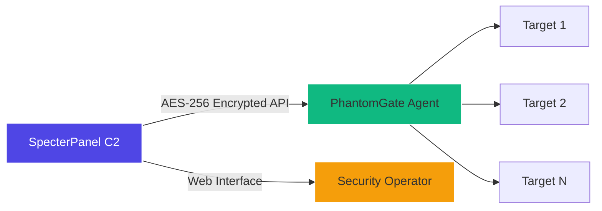
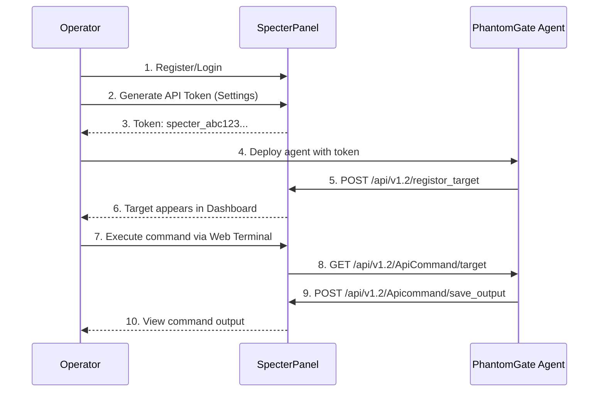

<!-- LOGO IMAGE - This will be visible in the README -->
<p align="center">
  
</p>

<!-- MAIN TITLE -->
<p align="center">
  
</p>

<!-- MODULE BADGES - CLEAN HEADER -->
<p align="center">
  
  
  
  
  
  
</p>

<!-- VERSION BADGES -->
<p align="center">
  
  
  
  
</p>

<!-- REPO STATS -->
<p align="center">
  
  
  
</p>

---

<!-- ASCII ART HEADER -->
<pre align="center">
                ╔═══════════════════════════════════════════════════════════════════╗
                ║  ███████╗██████╗ ███████╗ ██████╗████████╗███████╗██████╗         ║
                ║  ██╔════╝██╔══██╗██╔════╝██╔════╝╚══██╔══╝██╔════╝██╔══██╗        ║
                ║  ███████╗██████╔╝█████╗  ██║        ██║   █████╗  ██████╔╝        ║
                ║  ╚════██║██╔═══╝ ██╔══╝  ██║        ██║   ██╔══╝  ██╔══██╗        ║
                ║  ███████║██║     ███████╗╚██████╗   ██║   ███████╗██║  ██║        ║
                ║  ╚══════╝╚═╝     ╚══════╝ ╚═════╝   ╚═╝   ╚══════╝╚═╝  ╚═╝        ║
                ║                                                                   ║
                ║              Command & Control Platform v2.0                      ║
                ║         Advanced Security Operations for Professionals            ║
                ╚═══════════════════════════════════════════════════════════════════╝
</pre>

---

## CRITICAL NOTICE

<p align="center">
  <table>
    <tr>
      <td align="center" style="background: #1a1a2e; border-left: 6px solid #ff4d4d; border-radius: 10px; padding: 15px;">
        <strong>AUTHORIZED USE ONLY </strong><br>
        This tool is strictly for <strong>authorized security testing, educational purposes, and red-team engagements</strong>.<br>
        Users must comply with all applicable laws. Unauthorized access is illegal.<br>
        <em>Developers assume NO liability for misuse.</em>
      </td>
    </tr>
  </table>
</p>

---

## NAVIGATION MENU

<p align="center">
  <a href="#-overview"></a>
  <a href="#-key-features"></a>
  <a href="#-architecture"></a>
  <a href="#-complete-project-structure"></a>
  <a href="#-installation"></a>
  <a href="#-api-reference"></a>
  <a href="#-screenshots"></a>
</p>

---

## OVERVIEW

**SpecterPanel** is a modular, web‑based **Command and Control (C2) platform** designed for cybersecurity professionals, penetration testers, and red teams. Built with **Flask** and **SQLAlchemy**, it provides a unified interface for managing security operations, automating tasks, and coordinating offensive security workflows in a controlled and extensible environment.

The platform works in tandem with agents like **PhantomGate** (a cross‑platform remote administration tool) to provide a complete C2 ecosystem. All communication between the server and agents is **AES‑256 encrypted** to ensure confidentiality and integrity.


```mermaid
graph LR
    A[SpecterPanel C2] -->|AES-256 Encrypted API| B[PhantomGate Agent]
    A -->|Web Interface| C[Security Operator]
    B --> D[Target 1]
    B --> E[Target 2]
    B --> F[Target N]
    
    style A fill:#4f46e5,stroke:#fff,stroke-width:2px,color:#fff
    style B fill:#10b981,stroke:#fff
    style C fill:#f59e0b,stroke:#fff
```

---

## KEY FEATURES

<div align="center">
  
| Module | Description | Technology |
|:--------|:------------|:----------:|
| **Modular Core** | Flask blueprint architecture for easy extension |  |
| **Dashboard** | Real-time system overview and telemetry |  |
| **Encryption Layer** | AES-256-EAX for all API payloads |  |
| **Web Terminal** | Browser-based remote command execution |  |
| **Code Injection** | AI-powered payload generation with multi-model support, dynamic model selection, and deployment |   |
| **BotNet Manager** | Distributed agent orchestration |  |
| **Database ORM** | SQLAlchemy models for all entities |  |
| **Auth System** | JWT-based API token management |  |
| **Instruction Engine** | Per-target operational tasking |  |
| **Socket Manager** | Persistent communication channels |  |

</div>

---

## ARCHITECTURE

```
                    ┌────────────────────────────────────────────────────────┐
                    │                    SPECTERPANEL C2 SERVER              │
                    │  ┌──────────────┐  ┌──────────────┐  ┌──────────────┐  │
                    │  │  WEB LAYER   │  │  API LAYER   │  │  DATABASE    │  │
                    │  │ ──────────── │  │ ──────────── │  │ ──────────── │  │
                    │  │ • Dashboard  │  │ • /ApiCommand│  │ • Users      │  │
                    │  │ • Terminal   │  │ • /BotNet    │  │ • Targets    │  │
                    │  │ • Code Inject│  │ • /registor  │  │ • Commands   │  │
                    │  │ • Settings   │  │ • /injection │  │ • Payloads   │  │
                    │  └──────────────┘  └──────────────┘  └──────────────┘  │
                    │                            │                           |
                    │                    ┌───────┴───────┐                   │
                    │                    │  AES-256-EAX  │                   │
                    │                    │  ENCRYPTION   │                   │
                    │                    └───────┬───────┘                   │
                    │                            │                           │
                    │              ┌─────────────┴────────────┐              │
                    │              │                          │              │
                    │      ┌───────▼───────┐          ┌───────▼───────┐      │
                    │      │  PHANTOMGATE  │          │    CUSTOM     │      │
                    │      │    AGENT      │          │    AGENTS     │      │
                    │      └───────────────┘          └───────────────┘      │
                    └────────────────────────────────────────────────────────┘
```

---

## COMPLETE PROJECT STRUCTURE

```
SPECTERPANEL/
│
├──  api/                          # ENCRYPTED API ENDPOINTS
│   └──  api.py                    # All agent-facing API routes
│
├── db/                            # DATABASE LAYER
│   ├──  modle.py                  # SQLAlchemy ORM models
│   ├── mange_db.py                # Database session management
│   └──  info.json                 # Database configuration
│
├── event/                         # ERROR HANDLING
│   └── event.py                   # Global error handlers (404, 500)
│
├── log/                           # APPLICATION LOGS
│   └── log.txt                    # Runtime logging output
│
├──  static/                       # FRONTEND ASSETS
│   ├──  css/                      # Stylesheets
│   │   ├── style.css
│   │   └── dashboard.css
│   ├── js/                        # JavaScript files
│   │   ├── main.js
│   │   ├── terminal.js
│   │   └── dashboard.js
│   └── py/                        # Python payloads for injection
│       ├── keylogger.py
│       ├── screenshot.py
│       └── persistence.py
│
├──  utility/                      # CORE HELPERS & CONFIG
│   ├── control_db.py              # Database control functions
│   ├── email_temp.py              # Email templates
│   ├── processer.py               # JSON/data processing
│   └── setting.py                 # Global configuration
│       ├── ENCRYPTION_KEY         # AES encryption key
│       ├── SESSION_TIMEOUT        # Session settings
│       └── DATABASE_URI           # DB connection string
│
├── view/                          # WEB INTERFACE BLUEPRINTS
│   ├── botNet_manager.py          # Botnet control panel
│   ├── code_injection_panel.py    # Code injection UI
│   ├── public.py                  # Public routes (login, register)
│   ├── user_setting.py            # User settings management
│   ├── view.py                    # Main dashboard views
│   └── web_terminal.py            # Web-based terminal
│
├──  templates/                    # JINJA2 HTML TEMPLATES
│   ├── base.html                  # Base template
│   ├── dashboard.html             # Main dashboard
│   ├── terminal.html              # Web terminal page
│   ├── code_inject.html           # Code injection interface
│   ├── login.html                 # Login page
│   ├── register.html              # Registration page
│   ├── settings.html              # Settings page
│   ├── botnet.html                # Botnet management
│   └── 404.html                   # Error page
│
├── screen_shot/                   # DOCUMENTATION IMAGES
│   ├── dashbord.png
│   ├── api_link.png
│   ├── code_ground.png
│   ├── home.png
│   ├── login.png
│   ├── webTerminal.png
│   └── setting.png
│
├── app.py                         # MAIN FLASK APPLICATION
│   ├── Register blueprints
│   ├── Configure session security
│   └── Initialize extensions
│
├── initial_db.py                  # DATABASE INITIALIZATION
│   ├── Create tables
│   ├── Create admin user
│   └── Seed initial data
│
├── requirements.txt               # DEPENDENCIES
│   ├── flask==2.0.1
│   ├── flask-sqlalchemy==2.5.1
│   ├── cryptography==3.4.7
│   ├── pyjwt==2.1.0
│   └── ...
│
└──  README.md                     # PROJECT DOCUMENTATION
```

### File Count Summary

| Directory | Files | Purpose |
|:----------|:-----:|:--------|
| `/api` | 1 | Encrypted endpoints |
| `/db` | 3 | Database models & management |
| `/event` | 1 | Error handling |
| `/log` | 1 | Application logs |
| `/static` | 5+ | Frontend assets |
| `/utility` | 4 | Core configuration |
| `/view` | 6 | Web interface blueprints |
| `/templates` | 8+ | HTML templates |
| `/screen_shot` | 7 | Documentation images |
| **Root** | 4 | Main application files |

**Total Files:** 40+ core files supporting the entire C2 platform

---

## INSTALLATION

```bash
# Clone the repository
git clone https://github.com/omerKkemal/oh-tool-v2.git
cd oh-tool-v2

# Create and activate virtual environment
python3 -m venv venv
source venv/bin/activate  # On Windows: venv\Scripts\activate

# Install dependencies
pip install -r requirements.txt

# Initialize the database
python initial_db.py

# IMPORTANT: Update encryption key in utility/setting.py
# Set ENCRYPTION_KEY to a secure 32-byte key

# Run the application
flask run --host=0.0.0.0 --port=5000
```

**Access the platform:** `http://localhost:5000`

---

## QUICK START


```mermaid
sequenceDiagram
    
    Operator ->> SpecterPanel: 1. Register/Login
    Operator ->> SpecterPanel: 2. Generate API Token (Settings)
    SpecterPanel -->> Operator: 3. Token: specter_abc123...
    Operator ->> PhantomGate Agent: 4. Deploy agent with token
    PhantomGate Agent ->> SpecterPanel: 5. POST /api/v1.2/registor_target
    SpecterPanel -->> Operator: 6. Target appears in Dashboard
    Operator ->> SpecterPanel: 7. Execute command via Web Terminal
    SpecterPanel ->> PhantomGate Agent: 8. GET /api/v1.2/ApiCommand/target
    PhantomGate Agent ->> SpecterPanel: 9. POST /api/v1.2/Apicommand/save_output
    SpecterPanel -->> Operator: 10. View command output
```

---

## 🔌 API REFERENCE

<div align="center">

| Method | Endpoint | Description | Module |
|:------:|:---------|:------------|:------:|
| `GET` | `/api/v1.2/ApiCommand/<target>` | Get pending commands | Command Module |
| `POST` | `/api/v1.2/Apicommand/save_output` | Save command output | Command Module |
| `GET` | `/api/v1.2/BotNet/<target>` | Get botnet instructions | BotNet Module |
| `POST` | `/api/v1.2/registor_target` | Register new target | Target Module |
| `GET` | `/api/v1.2/get_instraction/<target>` | Get operational instructions | Instruction Module |
| `GET` | `/api/v1.2/injection/lib/<target>` | Serve payload file | Injection Module |
| `POST` | `/api/v1.2/injection/code_output_save/<target>` | Save injection output | Injection Module |

</div>

### Encrypted Payload Format

```json
{
    "nonce": "base64_encoded_nonce",
    "ciphertext": "base64_encoded_ciphertext", 
    "tag": "base64_encoded_tag"
}
```

---

## SCREENSHOTS

<div align="center">

### Dashboard Overview

*Real-time operational command center showing connected targets and system status*

---

### Web Terminal

*Browser-based remote command execution with real-time output*

---

### Code Injection Panel

*AI‑enhanced Python payload management and deployment interface with dynamic model selector*

---

### API Link Management

*Token generation and agent authentication management*

---

### Settings Panel

*Platform configuration, encryption key management, and system settings*

---

### Login Interface

*Secure authentication portal with registration option*

---

### Home Page

*Landing page and platform overview*

</div>

---

## AUTHOR

<div align="center">
  
**Omer Kemal**  
*Security Researcher & Developer*

| Project | Link |
|:--------|:-----|
| **C2 Server** | [SpecterPanel](https://github.com/omerKkemal/oh-tool-v2) |
| **Agent** | [PhantomGate](https://github.com/omerKkemal/PhontomGate) |
| **Purpose** | Security Education & Research |

For questions, feedback, or responsible disclosure, please open an issue on GitHub.

</div>

## LICENSE

<div align="center">
  


**All rights reserved. Unauthorized use, copying, or distribution is strictly prohibited.**

For licensing inquiries: omerkemal2019@gmail.com

</div>

---

<!-- FOOTER -->

<p align="center">
  
  <br>
  <sub>© 2024 SpecterPanel. All Rights Reserved.</sub>
</p>