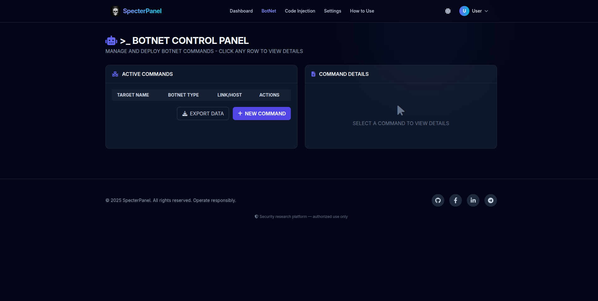
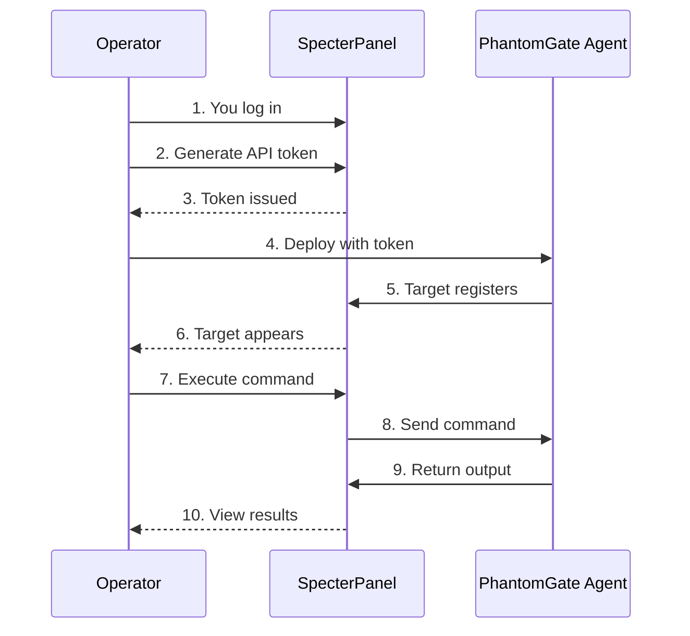

# SpecterPanel

<p align="center">
  
</p>

---

## Welcome to SpecterPanel

The C2 platform that actually works. Mostly.  
Designed for red teams, penetration testers, and security professionals who need to manage remote agents without the headache.

Think of it as your command center. But digital. And less cool-looking than the movies. But functional.

---

## Why SpecterPanel?

Because you deserve better than juggling terminals and spreadsheets.

Here's what you get:

### Centralized Management
See everything. Control everything. From one dashboard. Revolutionary, right?

### Encrypted Communications
AES-256 because sending plaintext over the internet is something we stopped doing in the 90s.

### Modular Design
Add what you need. Ignore what you don't. No bloat. Just functionality.

### Agent Integration
Works seamlessly with PhantomGate agents. Like they were made for each other. Because they were.

---

## What's In The Box

| Feature | What It Does For You |
|:--------|:---------------------|
| **Dashboard** | Real-time overview of all connected agents |
| **Web Terminal** | Execute commands from your browser |
| **Code Injection** | Deploy Python payloads with AI assistance |
| **Botnet Manager** | Track and control every agent |
| **API Gateway** | Secure, encrypted communication channel |
| **SQLite Database** | Persistent storage for targets and commands |

---

## Product Showcase

### Dashboard Overview
*Your command center. Everything you need. Nothing you don't.*


### Web Terminal
*Remote shell access. From your browser. It's like SSH. But different.*


### Code Injection Panel
*Generate and deploy Python payloads. AI helps. Because manual coding is so 2010.*


### BotNet Manager
*Track your agents. Manage your network. Feel like you're in a movie.*



### Settings Panel
*Configure. Customize. Control.*


### Secure Login
*Because security matters.*


### Home Page
*The landing point. Your gateway to control.*


---

## How It Works


```mermaid
sequenceDiagram
    
    Operator ->> SpecterPanel: 1. You log in
    Operator ->> SpecterPanel: 2. Generate API token
    SpecterPanel -->> Operator: 3. Token issued
    Operator ->> PhantomGate Agent: 4. Deploy with token
    PhantomGate Agent ->> SpecterPanel: 5. Target registers
    SpecterPanel -->> Operator: 6. Target appears
    Operator ->> SpecterPanel: 7. Execute command
    SpecterPanel ->> PhantomGate Agent: 8. Send command
    PhantomGate Agent ->> SpecterPanel: 9. Return output
    SpecterPanel -->> Operator: 10. View results
```

Simple. Direct. It just works.

---

## Technical Specifications

### Architecture
- Flask-based backend
- SQLite for data persistence
- AES-256 encryption for all communications
- Modular blueprints for scalability

### API Endpoints

| Method | Endpoint | Function |
|--------|----------|----------|
| `GET` | `/api/v1.2/ApiCommand/<target>` | Fetch pending commands |
| `POST` | `/api/v1.2/Apicommand/save_output` | Submit command output |
| `GET` | `/api/v1.2/BotNet/<target>` | Get botnet instructions |
| `POST` | `/api/v1.2/registor_target` | Register a target |
| `GET` | `/api/v1.2/get_instraction/<target>` | Get instructions |
| `GET` | `/api/v1.2/injection/lib/<target>` | Download payload |
| `POST` | `/api/v1.2/injection/code_output_save/<target>` | Save injection output |

All traffic is wrapped in AES-256-EAX encryption.

### Security Features
- Encrypted payloads
- API token authentication
- Session management
- Secure logging

---

## Quick Start

```bash
git clone https://github.com/omerKkemal/oh-tool-v2.git
cd oh-tool-v2

python3 -m venv venv
source venv/bin/activate

pip install -r requirements.txt

# Configure your encryption key in utility/setting.py

python initial_db.py

flask run --host=0.0.0.0 --port=5000
```

Access at: `http://localhost:5000`

---

## The Ecosystem

| Project | Purpose | Link |
|:--------|:--------|:-----|
| **SpecterPanel** | C2 Server | [GitHub](https://github.com/omerKkemal/oh-tool-v2) |
| **PhantomGate** | Agent | [GitHub](https://github.com/omerKkemal/PhontomGate) |
| **PhontomGate GUI** | Agent Interface | [GitHub](https://github.com/omerKkemal/flet-apps/tree/main/PhontomGate) |

Complete. Connected. Ready.

---

## About The Developer

**Omer Kemal** – Security Researcher & Developer

- C2 Server: [SpecterPanel](https://github.com/omerKkemal/oh-tool-v2)
- Agent: [PhantomGate](https://github.com/omerKkemal/PhontomGate)
- GUI: [PhontomGate Flet App](https://github.com/omerKkemal/flet-apps/tree/main/PhontomGate)

---

## License

Proprietary. All rights reserved.

---

<p align="center">
  <sub>© SpecterPanel. Built for professionals. By a professional.</sub>
  <br>
  <sub>Questions? Open an issue. Feedback? We want to hear it.</sub>
</p>
