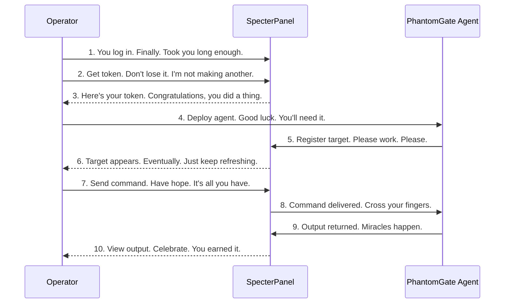

# SpecterPanel

<p align="center">
  
</p>

---

## So... This Exists Now

I made a C2 panel. Because the internet definitely needed more of those.  
Built for red teams, pentesters, and people who enjoy questioning their life choices.  
If you're here, you either know what you're doing or you're about to learn.  
Either way, it's going to be an experience.

---

## The Fine Print (Read It Or Don't, I'm Not Your Mom)

This is for **authorised testing**. Not for being a menace to society.  
If you use this on random people's computers, that's your problem.  
I'm not your lawyer. I'm not your alibi. I'm not even sure I'm a real person at this point.

"I didn't know" won't work. You know. I know you know. Don't play dumb.

---

## Wait. There's A GUI?

Yes. Because some people fear the terminal like it's a horror movie.

**Behold:** [PhontomGate Flet App](https://github.com/omerKkemal/flet-apps/tree/main/PhontomGate)

It's like the terminal, but with buttons. Because buttons are fun. And colors. And all that stuff.  
Build it for desktop. Build it for Android. Build it for your toaster. I don't care. Just don't break it.

*"You didn't find it. It found you."*  
– Someone who definitely didn't say that before

---

## What's In This Thing

- **Dashboard** – Look at your agents. Pretend you're in control. You're not. But it's fun.
- **Terminal** – Type words. Watch things happen. Feel powerful. It's a good feeling.
- **Code Injection** – AI writes code for you. Because manual coding is for people who know what they're doing.
- **Botnet Manager** – Track your agents. Like herding cats. Digital cats.
- **API Gateway** – Encrypted. Because plaintext is for amateurs and you're not an amateur, right? Right.
- **SQLite DB** – Stores things. Important things. Boring things. All the things.

It's got everything you need and nothing you don't. Except my sarcasm. You're stuck with that.

---

## How It All Works (Try To Keep Up)


```mermaid
sequenceDiagram
    
    Operator ->> SpecterPanel: 1. You log in. Finally. Took you long enough.
    Operator ->> SpecterPanel: 2. Get token. Don't lose it. I'm not making another.
    SpecterPanel -->> Operator: 3. Here's your token. Congratulations, you did a thing.
    Operator ->> PhantomGate Agent: 4. Deploy agent. Good luck. You'll need it.
    PhantomGate Agent ->> SpecterPanel: 5. Register target. Please work. Please.
    SpecterPanel -->> Operator: 6. Target appears. Eventually. Just keep refreshing.
    Operator ->> SpecterPanel: 7. Send command. Have hope. It's all you have.
    SpecterPanel ->> PhantomGate Agent: 8. Command delivered. Cross your fingers.
    PhantomGate Agent ->> SpecterPanel: 9. Output returned. Miracles happen.
    SpecterPanel -->> Operator: 10. View output. Celebrate. You earned it.
```

---

## The Folders No One Asked For

```
SPECTERPANEL/
├── api/             # The part that talks. Loudly.
├── db/              # Where data sleeps.
├── event/           # Where errors hang out.
├── log/             # Where errors go to die.
├── static/          # The pretty bits.
├── utility/         # The helpful bits.
├── view/            # The actual bits.
├── templates/       # The HTML bits.
├── screen_shot/     # The picture bits.
├── app.py           # The start button.
├── initial_db.py    # The setup wizard.
└── requirements.txt # The list of things you need.
```

---

## Getting It Running (Without Breaking Things)

```bash
git clone https://github.com/omerKkemal/oh-tool-v2.git
cd oh-tool-v2

python3 -m venv venv
source venv/bin/activate

pip install -r requirements.txt

# Edit setting.py. Set the encryption key. Do it. Now.
# I'll wait. Seriously. Don't skip this.

python initial_db.py

flask run --host=0.0.0.0 --port=5000
```

Then go to `http://localhost:5000`. Login with the credentials from the console.  
If you missed them, that's on you. I can't help you.

---

## The API Endpoints (For The Nerds)

| Method | Endpoint | What It Does (If You're Lucky) |
|--------|----------|--------------------------------|
| GET | `/api/v1.2/ApiCommand/<target>` | Gets commands. Sometimes. |
| POST | `/api/v1.2/Apicommand/save_output` | Saves output. Usually. |
| GET | `/api/v1.2/BotNet/<target>` | Gets botnet stuff. |
| POST | `/api/v1.2/registor_target` | Registers targets. (Yes, it's misspelled. No, I don't care.) |
| GET | `/api/v1.2/get_instraction/<target>` | Gets instructions. (More typos. More tears.) |
| GET | `/api/v1.2/injection/lib/<target>` | Downloads payloads. The fun stuff. |
| POST | `/api/v1.2/injection/code_output_save/<target>` | Saves injection output. Important. |

Everything is encrypted. Because we're professionals. Mostly.

---

## The Dark Trio

| Project | Description |
|---------|-------------|
| **SpecterPanel** | The C2 server (you're here) |
| **PhantomGate** | The agent (the phantom) |
| **PhontomGate GUI** | The pretty one (the Trojan horse) |

---

## Screenshots (Because You Can't Read)

<div align="center">

**Dashboard** – Look at all the things.  


**Terminal** – Type things. Watch things.  


**Code Injection** – AI magic.  


**BotNet Manager** – Herd your cats.  


**Settings** – Change all the things.  


**Login** – The door.  


**Home** – The start.  


</div>

---

## Who Made This And Why

**Omer Kemal** – Security Researcher, Developer, Caffeine Addict, Questionable Life Choices.

- [SpecterPanel](https://github.com/omerKkemal/oh-tool-v2)
- [PhantomGate](https://github.com/omerKkemal/PhontomGate)
- [PhontomGate GUI](https://github.com/omerKkemal/flet-apps/tree/main/PhontomGate)

---

## The Legal Bit

It's mine. Don't steal it. Don't misuse it. Be a decent human.

---

<p align="center">
  <sub>Built with coffee. Fueled by sarcasm. Supported by hope.</sub>
  <br>
  <sub>No warranty. No promises. No refunds.</sub>
  <br>
  <sub>Go outside. Touch grass. Or don't. I'm not your mom.</sub>
</p>
