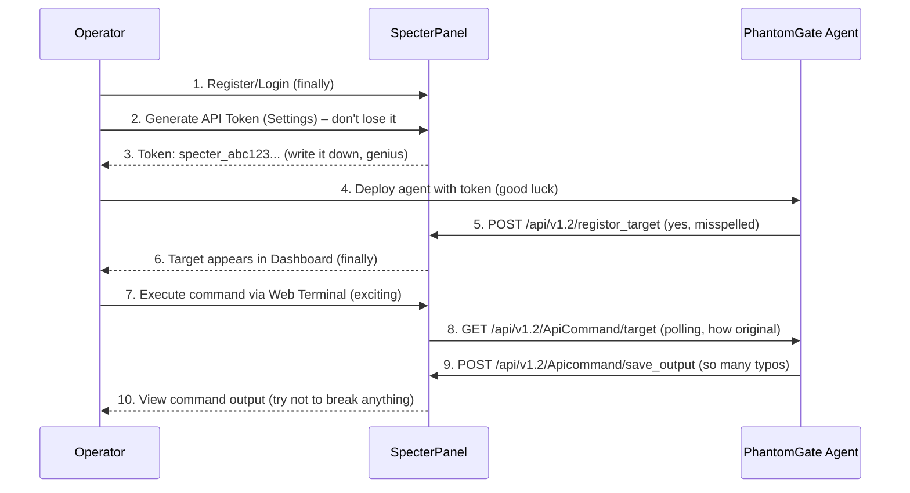

# SpecterPanel – yet another C2 panel (but this one's mine)

<p align="center">
  
</p>

Yeah, it's another C2 panel. Because the world definitely needed one more.  
Built for red teams, pentesters, and anyone who needs to manage remote agents without losing what's left of their sanity.

---

## ⚠️ Before you do anything stupid (read this or cry later)

This is for **authorised testing only**.  
If you point this at systems you don't own, that's illegal. I don't care what excuses you have.  
"I was just testing" won't hold up in court. You break the law, you deal with the consequences. Not me.

---

## What's inside? (spoiler: it's not that impressive)

- Web dashboard – see your agents at a glance (groundbreaking)
- Browser terminal – run commands like you're on a real shell (wow)
- Code injection panel – generate payloads with a bit of AI help (fancy)
- Botnet manager – keep track of all connected machines (try not to lose count)
- API gateway – all agent comms go through here, encrypted with AES‑256 (because plaintext is for amateurs)
- SQLite DB – stores targets, commands, output, users (the boring stuff)

No bloat. Just what you need. And a few things you don't.

---

## How it works (quick flow – try to keep up)


```mermaid
sequenceDiagram
    
    Operator ->> SpecterPanel: 1. Register/Login (finally)
    Operator ->> SpecterPanel: 2. Generate API Token (Settings) – don't lose it
    SpecterPanel -->> Operator: 3. Token: specter_abc123... (write it down, genius)
    Operator ->> PhantomGate Agent: 4. Deploy agent with token (good luck)
    PhantomGate Agent ->> SpecterPanel: 5. POST /api/v1.2/registor_target (yes, misspelled)
    SpecterPanel -->> Operator: 6. Target appears in Dashboard (finally)
    Operator ->> SpecterPanel: 7. Execute command via Web Terminal (exciting)
    SpecterPanel ->> PhantomGate Agent: 8. GET /api/v1.2/ApiCommand/target (polling, how original)
    PhantomGate Agent ->> SpecterPanel: 9. POST /api/v1.2/Apicommand/save_output (so many typos)
    SpecterPanel -->> Operator: 10. View command output (try not to break anything)
```

That's the gist. Agent checks in, gets commands, sends back output. You watch from your browser.  
It's not rocket science. It's just HTTP with extra steps.

---

## Project layout (the messy folder tree)

```
SPECTERPANEL/
├── api/             # endpoints agents talk to (if they can find them)
├── db/              # database models + session handling (the boring stuff)
├── event/           # error handlers (404, 500 – you'll see these a lot)
├── log/             # where errors go to die (and they will)
├── static/          # CSS, JS, payload templates (the pretty stuff)
├── utility/         # config, helpers, email templates (the behind-the-scenes)
├── view/            # Flask blueprints for each UI (actual functionality)
├── templates/       # HTML files (Jinja2 – because pure HTML is too easy)
├── screen_shot/     # images for this README (you're looking at them)
├── app.py           # main entry point (start here)
├── initial_db.py    # creates tables and admin user (don't skip this)
└── requirements.txt # dependencies (you need these)
```

Yes, `mange_db.py` is misspelled. I'll fix it someday. Probably not today though.

---

## Getting it running (without breaking everything)

```bash
git clone https://github.com/omerKkemal/oh-tool-v2.git
cd oh-tool-v2

# set up virtual environment (because you should)
python3 -m venv venv
source venv/bin/activate   # or .\venv\Scripts\activate on Windows

# install stuff (and pray it works)
pip install -r requirements.txt

# IMPORTANT: edit utility/setting.py and set ENCRYPTION_KEY to a real 32-byte key
# don't skip this, or encryption is worthless. Seriously. Do it.

# create database and default admin
python initial_db.py

# run it (fingers crossed)
flask run --host=0.0.0.0 --port=5000
```

Open `http://localhost:5000`. Login with the credentials shown after running `initial_db.py`.  
If you forgot to check the console, that's your problem.

---

## API endpoints (for the agent developers who actually read docs)

| Method | Endpoint | What it does (badly) |
|--------|----------|----------------------|
| `GET` | `/api/v1.2/ApiCommand/<target>` | fetch pending commands (if any) |
| `POST` | `/api/v1.2/Apicommand/save_output` | submit command result (try not to break the schema) |
| `GET` | `/api/v1.2/BotNet/<target>` | get botnet instructions (very hacker) |
| `POST` | `/api/v1.2/registor_target` | register a new target (yes, it's spelled wrong) |
| `GET` | `/api/v1.2/get_instraction/<target>` | pull operational instructions (more typos) |
| `GET` | `/api/v1.2/injection/lib/<target>` | download payload file (the fun stuff) |
| `POST` | `/api/v1.2/injection/code_output_save/<target>` | save injection output (because tracking is important) |

All requests/responses are wrapped in AES-256-EAX. The format:

```json
{
  "nonce": "base64...",
  "ciphertext": "base64...",
  "tag": "base64..."
}
```

If you don't encrypt, the server will ignore you. It's not being rude – it's just security.

---

## Screenshots (because reading is hard)

<div align="center">

### Dashboard Overview

*Look, a dashboard! It shows things!*

---

### Web Terminal

*Type commands. Get output. It's like a real terminal but in a browser.*

---

### Code Injection Panel

*AI‑enhanced payloads. Because manual coding is for peasants.*

---

### BotNet Management

*Track your minions. I mean, agents.*

---

### Settings Panel

*Change things. Break things. Fix things.*

---

### Login Interface

*Type username. Type password. Don't forget it.*

---

### Home Page

*The landing page. Stare at it while you think about life choices.*

</div>

---

## Who made this? (the blame assignment)

**Omer Kemal** – security researcher, developer, caffeine addict, and occasional regret-haver.

- C2: [SpecterPanel](https://github.com/omerKkemal/oh-tool-v2)
- Agent: [PhantomGate](https://github.com/omerKkemal/PhontomGate)

Found a bug? Open an issue. Want to improve something? Send a PR.  
Rude comments? Keep them to yourself. I have enough sarcasm already.

---

## License

Proprietary – all rights reserved.  
Don't copy the whole thing and sell it. That's just lazy.  
For licensing questions: omerkemal2019@gmail.com (but don't expect a reply)

---

<p align="center">
  <sub>No warranty, no promises. Use at your own risk. And don't be a script kiddie.</sub>
  <br>
  <sub>Seriously, I'm not responsible for your bad decisions.</sub>
</p>
