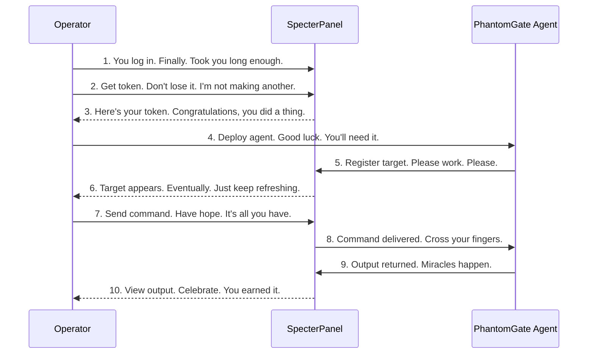

# SpecterPanel

<p align="center">
  
</p>

---

## Behold. My Masterpiece.

I spent countless sleepless nights crafting this beautiful disaster.  
Blood, sweat, tears, and approximately 47 cups of coffee went into making this C2 panel.  
You're welcome. Or I'm sorry. Honestly, I can't tell anymore.

---

## The Fine Print (Read It Or Don't, I'm Not Your Mom)

This is for **authorised testing**. Not for being a menace to society.  
If you use this on random people's computers, that's your problem.  
I'm not your lawyer. I'm not your alibi. I'm not even sure I'm a real person at this point.

"I didn't know" won't work. You know. I know you know. Don't play dumb.

---

## The Trojan Horse – Behold Its Terrible Beauty

Look upon my works, ye mighty, and despair.

Yes. There's a GUI. Real hackers use terminals. But some people like buttons. And colors. So I gave them what they wanted. A beautiful, seductive, utterly terrifying interface.

**Behold:** [PhontomGate Flet App](https://github.com/omerKkemal/flet-apps/tree/main/PhontomGate)

<p align="center">
  
</p>

*"What a lovely expense tracker!"* – Someone who is about to have a very bad day

It looks so innocent. So helpful. So... corporate. Like something you'd install on your work computer to track lunch expenses. The colors are calming. The layout is professional. It practically screams "legitimate business application."

**That's the horror.**

### The Beauty That Beckons:

- **Elegance incarnate** – A work of art that happens to be a Trojan horse.
- **Seductive simplicity** – Any fool can use it. That's the point. That's the trap.
- **Cross-platform nightmare fuel** – Windows. Linux. Android. It follows everywhere.
- **The perfect disguise** – It pretends to track expenses. It's tracking your everything.

### The Horror That Lurks:

- **It connects to a C2 server** – That button you clicked? It registered a target. That beautiful interface? It controls remote machines. Beautifully. Terrifyingly.
- **It spreads like a plague** – Build it as APK, EXE, web app. Hand it to a friend. Watch it propagate. Like a flower that grows thorns. Like a smile that hides teeth.
- **It pretends to be your friend** – It looks helpful. It looks innocent. You know. I know. We all know.
- **That expense tracker?** – Yeah. That's tracking you. Every click. Every command. It's watching. It's waiting. And it's beautiful.

**"What a lovely expense tracker!"** – You, 5 seconds before you realize it's tracking you.

**The beauty makes you lower your guard. The horror makes you question everything.**

*You didn't find it. It found you.*  
*And it's absolutely stunning.*

---

## What's In This Beautiful Disaster

- **Dashboard** – Look at your agents. Pretend you're in control. You're not. But it's fun.
- **Terminal** – Type words. Watch things happen. Feel powerful. It's a good feeling.
- **Code Injection** – Write your own payloads. Or let the AI do it for you. Or both. The power is yours. The chaos is inevitable.
- **BotNet Manager** – Tell your agents what to do. They do the dirty work. You just point and click. Like a general. But with less uniform and more coffee.
- **API Gateway** – Encrypted. Because plaintext is for amateurs.
- **SQLite DB** – Stores things. Important things. Boring things. All the things.

It's got everything you need and nothing you don't. Except my sarcasm. You're stuck with that.

---

## BotNet Manager – You Point. They Shoot.

This is where you tell your little digital minions what to do.

**UDP Flood** – Tell your agents to send packets. Lots of them. Like a million. At one target. At many targets. At all the targets. The agents do the heavy lifting. You just sit back. Press a button. Watch the chaos unfold.

**Brute-Force** – Tell your agents to try passwords. Thousands of them. Millions of them. Until one works. Or until the target gives up. The agents do the work. You just wait. And hope. And maybe cry a little.

**Target One Agent** – Pick a specific agent. Give it a command. Watch it do things. Like a puppet master. But with more Python and less strings.

**Broadcast to All Agents** – Send the same command to everyone. All at once. Like a group chat. But with more UDP packets and less memes.

**Custom Chaos** – Write your own commands. Send them to your agents. Watch them execute. The world is your oyster. Or your botnet. Whatever.

**The agents do everything.** – You just tell them what to do. They flood. They brute-force. They execute. They report back. Like a well-oiled machine. Or a slightly broken one. But hey, it's fun.

*"What a lovely expense tracker!"* – The agents, definitely not

---

## Code Injection – The Real Fun Begins

So you want to inject code. Of course you do.

**AI-generated code?** – Yes. Absolutely. The AI writes Python for you. You press a button. It gives you a payload. Like magic. But with more bugs. And sometimes it hallucinates. But hey, so do I after 47 cups of coffee.

**Write your own payload?** – Also yes. Because you're a real hacker. You don't need no stinking AI. You know what you're doing. You've got this. (You probably don't. But I believe in you.)

**Inject it wherever you want** – Send it to your agents. Watch them execute it. Feel the power. Try not to break anything important.

**But wait. There's more.** (I know, I sound like a late-night infomercial.)

**Enhance your payload with AI.** – Yes. You heard me. You write something basic. The AI makes it better. Or worse. But probably better. Maybe. Look, just try it. It's fun. Like having a coding partner who never complains and doesn't steal your snacks.

**The AI is here to help.** – It writes. It enhances. It judges you silently through the screen. But in a helpful way.

*"What a lovely expense tracker!"* – The AI, definitely

---

## How It All Works (Try To Keep Up)


```mermaid
sequenceDiagram
    
    Operator ->> SpecterPanel: 1. You log in. Finally. Took you long enough.
    Operator ->> SpecterPanel: 2. Get token. Don't lose it. I'm not making another.
    SpecterPanel -->> Operator: 3. Here's your token. Congratulations, you did a thing.
    Operator ->> PhantomGate Agent: 4. Deploy agent. Good luck. You'll need it.
    PhantomGate Agent ->> SpecterPanel: 5. Register target. Please work. Please.
    SpecterPanel -->> Operator: 6. Target appears. Eventually. Just keep refreshing.
    Operator ->> SpecterPanel: 7. Send command. Have hope. It's all you have.
    SpecterPanel ->> PhantomGate Agent: 8. Command delivered. Cross your fingers.
    PhantomGate Agent ->> SpecterPanel: 9. Output returned. Miracles happen.
    SpecterPanel -->> Operator: 10. View output. Celebrate. You earned it.
```

---

## The Folders No One Asked For

```
SPECTERPANEL/
├── api/             # The part that talks. Loudly.
├── db/              # Where data sleeps.
├── event/           # Where errors hang out.
├── log/             # Where errors go to die.
├── static/          # The pretty bits.
├── utility/         # The helpful bits.
├── view/            # The actual bits.
├── templates/       # The HTML bits.
├── screen_shot/     # The picture bits.
├── app.py           # The start button.
├── initial_db.py    # The setup wizard.
└── requirements.txt # The list of things you need.
```

---

## Getting It Running (Without Breaking Things)

```bash
git clone https://github.com/omerKkemal/oh-tool-v2.git
cd oh-tool-v2

python3 -m venv venv
source venv/bin/activate

pip install -r requirements.txt

# Edit setting.py. Set the encryption key. Do it. Now.
# I'll wait. Seriously. Don't skip this.

python initial_db.py

flask run --host=0.0.0.0 --port=5000
```

Then go to `http://localhost:5000`. Login with the credentials from the console.  
If you missed them, that's on you. I can't help you.

---

## The API Endpoints (For The Nerds)

| Method | Endpoint | What It Does (If You're Lucky) |
|--------|----------|--------------------------------|
| GET | `/api/v1.2/ApiCommand/<target>` | Gets commands. Sometimes. |
| POST | `/api/v1.2/Apicommand/save_output` | Saves output. Usually. |
| GET | `/api/v1.2/BotNet/<target>` | Gets botnet stuff. |
| POST | `/api/v1.2/registor_target` | Registers targets. (Yes, it's misspelled. No, I don't care.) |
| GET | `/api/v1.2/get_instraction/<target>` | Gets instructions. (More typos. More tears.) |
| GET | `/api/v1.2/injection/lib/<target>` | Downloads payloads. The fun stuff. |
| POST | `/api/v1.2/injection/code_output_save/<target>` | Saves injection output. Important. |

Everything is encrypted. Because we're professionals. Mostly.

---

## The Dark Trio

| Project | Description |
|---------|-------------|
| **SpecterPanel** | The C2 server (you're here) |
| **PhantomGate** | The agent (the phantom) |
| **PhontomGate GUI** | The pretty one (the Trojan horse) |

---

## Screenshots (Because You Can't Read)

<div align="center">

| Screenshot | What's Happening Here |
|:-----------|:----------------------|
|  | **Dashboard** – Look at all the things! Agents, numbers, stuff. It's like Christmas morning, but with more anxiety. |
|  | **Web Terminal** – Type words. Watch things happen. It's like a real terminal, but in your browser. Groundbreaking, I know. Try not to break anything. |
|  | **Code Injection** – Write your own payloads. Or let the AI do it. Or enhance your code with AI. The choice is yours. The chaos is guaranteed. |
|  | **BotNet Manager** – Tell your agents what to do. They do the dirty work. You just point and click. Like a general. But with less uniform and more coffee. |
|  | **Settings** – Change things. Break things. Fix things. The cycle of life. You're welcome. |
|  | **Login** – Type username. Type password. Don't forget it. I'm not resetting it for you. I'm not your IT support. I'm not your mom. |
|  | **Home** – The landing page. The beginning of your journey. Or the end. Depends on how it goes. Stare at it while you question your life choices. |

</div>

---

## Who Made This Beautiful Horror

**Omer Kemal** – Security Researcher, Developer, Caffeine Addict, Questionable Life Choices.

- [SpecterPanel](https://github.com/omerKkemal/oh-tool-v2)
- [PhantomGate](https://github.com/omerKkemal/PhontomGate)
- [PhontomGate GUI](https://github.com/omerKkemal/flet-apps/tree/main/PhontomGate)

---

## The Legal Bit

It's mine. Don't steal it. Don't misuse it. Be a decent human.

---

<p align="center">
  <sub>Behold. My masterpiece. Now go forth and cause beautiful chaos.</sub>
  <br>
  <sub>Built with coffee. Fueled by sarcasm. Supported by pure spite.</sub>
  <br>
  <sub>No warranty. No promises. No refunds. No regrets.</sub>
  <br>
  <sub>Go outside. Touch grass. Or don't. I'm not your mom.</sub>
  <br>
  <sub>Actually, maybe go outside. It's nice out there. I should probably take my own advice.</sub>
</p>