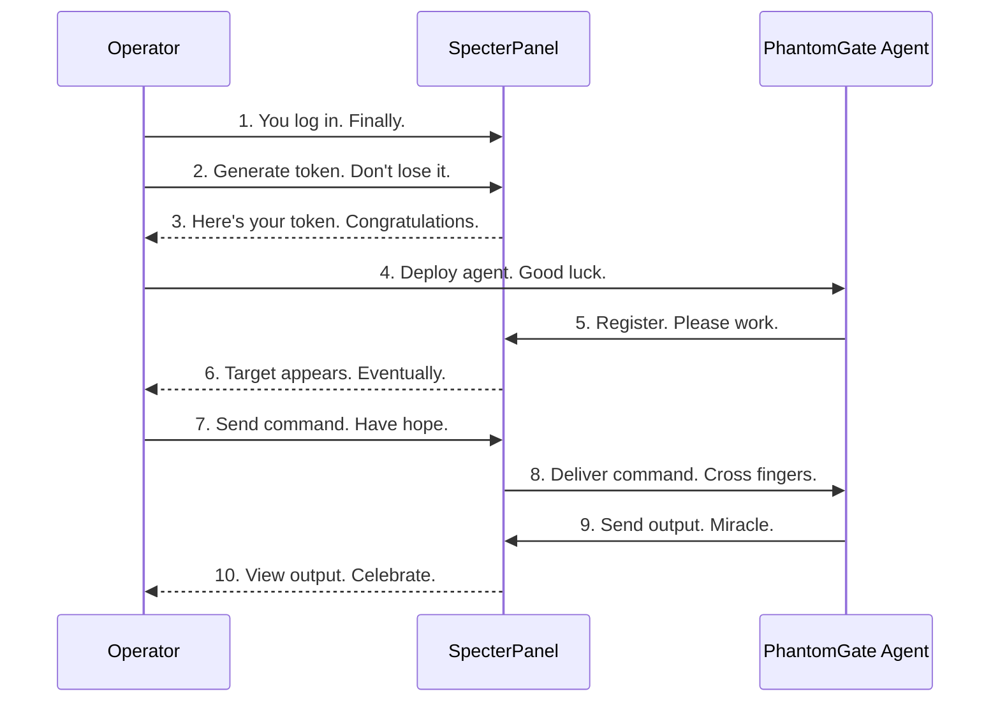

# SpecterPanel

<p align="center">
  
</p>

---

## Introducing SpecterPanel

The C2 platform you never knew you needed.  
Built for red teams, penetration testers, and security professionals who have given up on finding a C2 that actually works.

*"It's like having a command center. But cheaper. And with more bugs."*  
– Me, definitely not a satisfied customer

---

## Why SpecterPanel? (Because You Have No Choice)

**Tired of juggling terminals?**  
SpecterPanel gives you a dashboard. Revolutionary, right?

**Tired of sending plaintext like it's 1995?**  
We've got AES-256 encryption. Because we're fancy like that.

**Tired of bloated software that does everything except work?**  
We stripped it down. No fluff. Just the essentials. And a few typos.

**Tired of agents that don't connect?**  
Our agents connect. Eventually. Usually.

---

## What's In The Box (Be Excited. Please.)

| Feature | What It Does (Supposedly) |
|:--------|:--------------------------|
| **Dashboard** | Shows you things. Agents, mostly. If they're alive. Hopefully. |
| **Web Terminal** | Run commands. Get output. It's like a terminal. In a browser. Mind-blowing. |
| **Code Injection** | AI-powered payloads. Because coding is hard. Let the robot do it. |
| **Botnet Manager** | Track your agents. Like herding cats. Digital cats. |
| **API Gateway** | Encrypted communication. Because plaintext is for people who enjoy getting caught. |
| **SQLite Database** | Stores everything. Because memory is for amateurs. |

---

## What Our Satisfied Users Say

*"It crashed only 3 times today. That's a new record."*

*"I've been using this for 6 months. I'm still not sure how it works. But it works. Mostly."*

*"The typos in the API endpoints are a feature. Not a bug. That's what I tell myself."*

*"I wanted to throw my laptop out the window. But then I fixed it. And it worked. For 5 minutes."*

---

## Product Showcase

### Dashboard Overview
*"This dashboard has a 100% success rate of looking like a dashboard."*


### Web Terminal
*"Type things. See things happen. It's basically magic. But with more errors."*


### Code Injection Panel
*"AI writes the code. You press the button. Everyone's happy."*


### BotNet Manager
*"Track your agents. Feel powerful. Realize you have no control over anything."*


### Settings Panel
*"Change things. Break things. Fix things. The cycle continues."*


### Login Interface
*"Enter your credentials. Pretend you're a real hacker. We won't tell anyone."*


### Home Page
*"The landing page. The beginning of your journey. Or the end. Depends on how it goes."*


---

## How It Works (Amazingly Simple)


```mermaid
sequenceDiagram
    
    Operator ->> SpecterPanel: 1. You log in. Finally.
    Operator ->> SpecterPanel: 2. Generate token. Don't lose it.
    SpecterPanel -->> Operator: 3. Here's your token. Congratulations.
    Operator ->> PhantomGate Agent: 4. Deploy agent. Good luck.
    PhantomGate Agent ->> SpecterPanel: 5. Register. Please work.
    SpecterPanel -->> Operator: 6. Target appears. Eventually.
    Operator ->> SpecterPanel: 7. Send command. Have hope.
    SpecterPanel ->> PhantomGate Agent: 8. Deliver command. Cross fingers.
    PhantomGate Agent ->> SpecterPanel: 9. Send output. Miracle.
    SpecterPanel -->> Operator: 10. View output. Celebrate.
```

**It's simple. It works. It's not rocket science. It's just HTTP with extra steps.**

---

## Technical Specifications (The Nerd Stuff)

### Architecture
- Flask-based backend (obviously)
- SQLite database (because we hate scalability)
- AES-256 encryption (because we love security)
- Modular blueprints (because we love folders)

### API Endpoints (There Are Typos. Yes, We Know.)

| Method | Endpoint | What It Does |
|--------|----------|--------------|
| `GET` | `/api/v1.2/ApiCommand/<target>` | Gets commands. Sometimes. |
| `POST` | `/api/v1.2/Apicommand/save_output` | Saves output. Usually. |
| `GET` | `/api/v1.2/BotNet/<target>` | Gets botnet instructions. |
| `POST` | `/api/v1.2/registor_target` | Registers targets. (It's spelled wrong. Deal with it.) |
| `GET` | `/api/v1.2/get_instraction/<target>` | Gets instructions. (More typos.) |
| `GET` | `/api/v1.2/injection/lib/<target>` | Downloads payloads. |
| `POST` | `/api/v1.2/injection/code_output_save/<target>` | Saves injection output. |

**All traffic is encrypted. If you send plaintext, the server will ignore you. It's not rude. It's just security.**

---

## Security Features (Because We Try)

- AES-256 encryption (the good kind)
- API token authentication (secure. maybe.)
- Session management (we think)
- Encrypted payloads (we hope)

---

## Quick Start (The Part You Actually Need)

```bash
git clone https://github.com/omerKkemal/oh-tool-v2.git
cd oh-tool-v2

python3 -m venv venv
source venv/bin/activate

pip install -r requirements.txt

# Edit utility/setting.py. Set encryption key. Don't skip this. Seriously.

python initial_db.py

flask run --host=0.0.0.0 --port=5000
```

Access at: `http://localhost:5000`

**If it doesn't work, it's probably your fault. Not ours.**

---

## The Ecosystem (Because One Thing Isn't Enough)

| Project | Purpose |
|:--------|:--------|
| **SpecterPanel** | C2 Server (you're here) |
| **PhantomGate** | Agent (the phantom) |
| **PhontomGate GUI** | Agent GUI (for the button-pushers) |

---

## About The Developer

**Omer Kemal** – Security Researcher, Developer, Caffeine Addict, Regret-Haver

- C2: [SpecterPanel](https://github.com/omerKkemal/oh-tool-v2)
- Agent: [PhantomGate](https://github.com/omerKkemal/PhontomGate)
- GUI: [PhontomGate Flet App](https://github.com/omerKkemal/flet-apps/tree/main/PhontomGate)

Found a bug? Open an issue.  
Want to improve something? Send a PR.  
Rude comments? Keep them. We have enough.

---

## License

Proprietary. All rights reserved.  
Don't steal it. That's rude.

---

<p align="center">
  <sub>© SpecterPanel. Built with caffeine and questionable life choices.</sub>
  <br>
  <sub>No warranty. Use at your own risk. We're not your mom.</sub>
</p>
