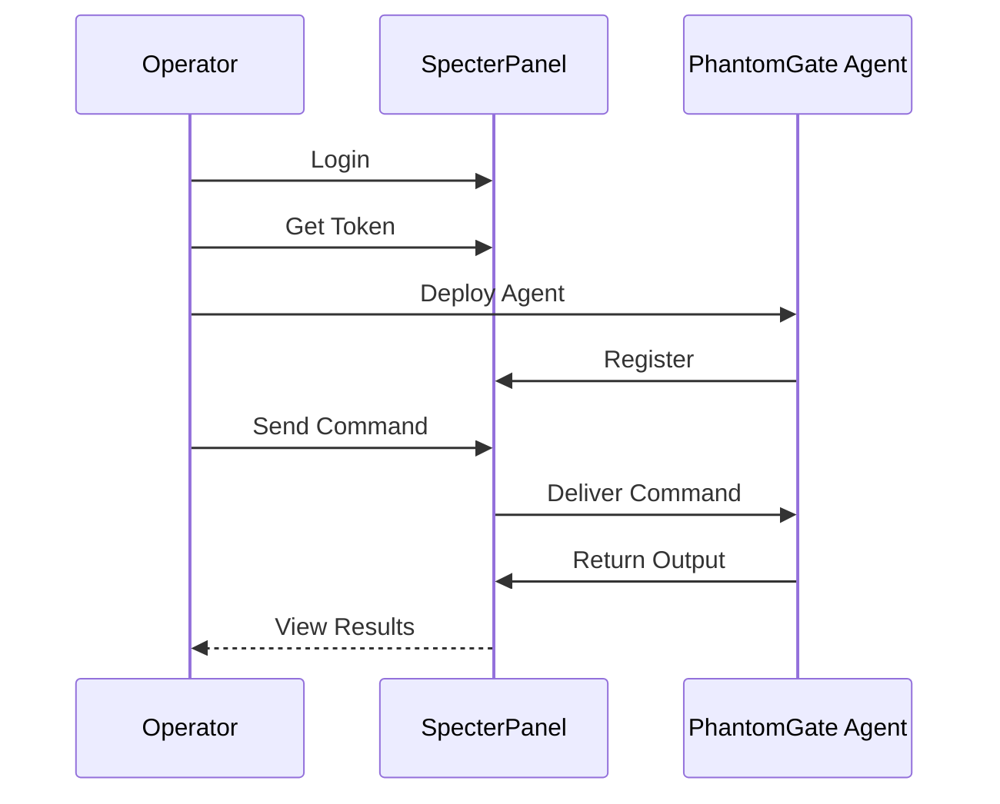

# SPECTERPANEL

<p align="center">
  
</p>

---

## The Deal

You need a C2. I built a C2. Here it is.

No marketing fluff. No "revolutionary" claims. It works. Sometimes. Let's be honest.

---

## What It Does

- Agents connect (assuming you set up the config right)
- You send commands (assuming you know what you're doing)
- They execute (assuming the target doesn't crash)
- You get output (assuming everything went according to plan)

That's it. That's the whole thing. Don't overthink it.

---

## Components

There's a dashboard. A terminal. A code injector. A botnet manager. An API gateway. A database.  
They all exist. They all do things. You'll figure it out.

If you've used a C2 before, you know the drill.

If you haven't... why are you here?

---

## GUI Version

Yes, there's a GUI for the agent. No, it doesn't make you a better hacker.  
But it does make things easier if you don't want to type commands all day.

[PhontomGate Flet App](https://github.com/omerKkemal/flet-apps/tree/main/PhontomGate)

---

## Architecture

It's Flask. It's SQLite. It's AES encryption. It's modular.  
If you know what those words mean, you're fine.  
If you don't, you might want to learn.

---

## How The Flow Works


```mermaid
sequenceDiagram
    
    Operator ->> SpecterPanel: Login
    Operator ->> SpecterPanel: Get Token
    Operator ->> PhantomGate Agent: Deploy Agent
    PhantomGate Agent ->> SpecterPanel: Register
    Operator ->> SpecterPanel: Send Command
    SpecterPanel ->> PhantomGate Agent: Deliver Command
    PhantomGate Agent ->> SpecterPanel: Return Output
    SpecterPanel -->> Operator: View Results
```

That's the loop. It repeats. You get things done. Or not. Up to you.

---

## Installation

```bash
git clone https://github.com/omerKkemal/oh-tool-v2.git
cd oh-tool-v2

python3 -m venv venv
source venv/bin/activate

pip install -r requirements.txt

# Set your encryption key in utility/setting.py
# Don't skip this. It won't work if you do.

python initial_db.py

flask run --host=0.0.0.0 --port=5000
```

---

## API Endpoints

| Method | Endpoint | What It Does |
|--------|----------|--------------|
| GET | `/api/v1.2/ApiCommand/<target>` | Get commands |
| POST | `/api/v1.2/Apicommand/save_output` | Save output |
| GET | `/api/v1.2/BotNet/<target>` | Get bot instructions |
| POST | `/api/v1.2/registor_target` | Register target |
| GET | `/api/v1.2/get_instraction/<target>` | Get instructions |
| GET | `/api/v1.2/injection/lib/<target>` | Download payload |
| POST | `/api/v1.2/injection/code_output_save/<target>` | Save injection |

Everything is encrypted. Send plaintext and you'll be ignored.

---

## Screenshots

Because you probably want to see what you're getting into.

<div align="center">

**Dashboard** – Things on a screen. Useful things, apparently.  


**Terminal** – Type. See results. Feels powerful.  


**Code Injection** – AI writes code. You click buttons.  


**BotNet Manager** – Track agents. Feel in control.  


**Settings** – Configure. Customize. Break. Fix.  


**Login** – Enter credentials. Gain access.  


**Home** – The landing page. Welcome.  


</div>

---

## The Ecosystem

Three projects. One purpose.

| Project | Description |
|---------|-------------|
| **SpecterPanel** | The C2 server |
| **PhantomGate** | The agent |
| **PhontomGate GUI** | The GUI wrapper |

---

## The Developer

Omer Kemal.  
Security researcher. Developer. Coffee drinker.

- [SpecterPanel](https://github.com/omerKkemal/oh-tool-v2)
- [PhantomGate](https://github.com/omerKkemal/PhontomGate)
- [PhontomGate GUI](https://github.com/omerKkemal/flet-apps/tree/main/PhontomGate)

---

## Legal

Proprietary. All rights reserved.  
Don't steal it. Don't misuse it. Use it responsibly.

---

<p align="center">
  <sub>Built with effort. Maintenance optional. No warranty. Good luck.</sub>
</p>
