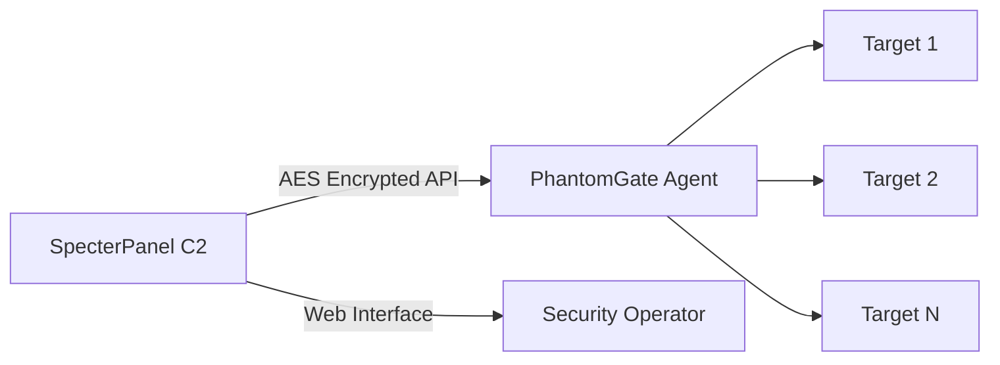

<p align="center">
  
  <br>
  <strong>Advanced Command & Control (C2) Platform for Security Professionals</strong>
</p>

<p align="center">
  
  
  
  
  
</p>

---

<div align="center">
  
</div>

---

## ⚠️ IMPORTANT DISCLAIMER

> **This tool is intended solely for authorized security testing and educational purposes.**  
> Use responsibly and in compliance with all applicable laws and regulations.  
> Unauthorized use is strictly prohibited.

---

## 📚 Table of Contents

- [Overview](#-overview)
- [Key Features](#-key-features)
- [Architecture](#-architecture)
- [Installation](#-installation)
- [Quick Start](#-quick-start)
- [Modules & Components](#-modules--components)
- [API Endpoints](#-api-endpoints)
- [Screenshots](#-screenshots)
- [License](#-license)
- [Contact](#-contact)

---

## 🔭 Overview

**SpecterPanel** is a modular, web‑based **Command and Control (C2) platform** designed for cybersecurity professionals, penetration testers, and red teams. Built with **Flask** and **SQLAlchemy**, it provides a unified interface for managing security operations, automating tasks, and coordinating offensive security workflows in a controlled and extensible environment.

The platform works in tandem with agents like **PhantomGate** (a cross‑platform remote administration tool) to provide a complete C2 ecosystem. All communication between the server and agents is **AES‑256 encrypted** to ensure confidentiality and integrity.


```mermaid
graph LR
    A[SpecterPanel C2] -->|AES Encrypted API| B[PhantomGate Agent]
    A -->|Web Interface| C[Security Operator]
    B --> D[Target 1]
    B --> E[Target 2]
    B --> F[Target N]
```

---

✨ Key Features

<div>

 Feature Description
🧩 Modular Architecture Easily extendable with Flask blueprints and dedicated modules
📊 Unified Dashboard Real‑time overview of all platform activities and connected systems
🔐 Encrypted Communication AES‑EAX encryption for all API request/response payloads
🗄️ Database Integration SQLAlchemy‑powered models for users, commands, logs, and targets
💻 Web Terminal Built‑in browser‑based terminal for executing commands on remote targets
📦 Code Injection Panel Manage, upload, and inject custom Python payloads into target systems
🤖 Botnet Management Dedicated panel for managing distributed agents and botnet actions
📝 User Instruction System Assign and manage per‑user instructions for targets
🔑 API Token Management Generate, revoke, and manage API tokens for agent authentication
🐞 Event & Error Handling Custom error pages and detailed logging for improved debugging
🎨 Responsive UI Modern interface with dynamic templates and static asset support
🔌 Socket Management Configure socket‑based communication with targets for persistent access

</div>

---

🏗️ Architecture

```
┌─────────────────────────────────────────────────────────────┐
│                    SpecterPanel C2 Server                   │
├───────────────┬───────────────────────────────┬─────────────┤
│  Web Interface│          API Layer            │  Database   │
│  (Flask Views)│    (AES Encrypted Endpoints)  │ (SQLAlchemy)│
├───────────────┼───────────────────────────────┼─────────────┤
│ • Dashboard   │ • Command Execution           │ • Users     │
│ • Terminal    │ • Target Registration         │ • Targets   │
│ • Code Inject │ • Botnet Instructions         │ • Commands  │
│ • Settings    │ • Code Injection              │ • Payloads  │
└───────────────┴───────────────────────────────┴─────────────┘
                           │
                    AES Encrypted API
                           │
                    ┌──────┴────-──┐
                    │              │
              ┌─────▼─────┐  ┌─────▼─────┐
              │PhantomGate│  │  Other    │
              │   Agent   │  │  Agents   │
              └───────────┘  └───────────┘
```

Project Structure

```
SpecterPanel/
├── api/                      # Encrypted API endpoints
│   └── api.py
├── db/                        # Database layer
│   ├── modle.py              # ORM models
│   ├── mange_db.py           # Session helpers
│   └── info.json
├── event/                     # Error handlers
│   └── event.py
├── log/                       # Application logs
│   └── log.txt
├── static/                     # Frontend assets
│   ├── css/
│   ├── js/
│   └── py/                    # Python payloads
├── utility/                    # Helper modules
│   ├── control_db.py
│   ├── email_temp.py
│   ├── processer.py
│   └── setting.py             # Global config
├── view/                       # Web interface blueprints
│   ├── botNet_manager.py
│   ├── code_injection_panel.py
│   ├── public.py
│   ├── user_setting.py
│   ├── view.py
│   └── web_terminal.py
├── templates/                  # Jinja2 HTML templates
├── app.py                      # Main Flask application
├── initial_db.py               # Database initialization
├── requirements.txt
└── screen_shot/                # Documentation
    ├── dashbord.png
    ├── api_link.png
    ├── code_ground.png
    ├── home.png
    ├── login.png
    ├── webTerminal.png
    └── setting.png
```

---

⚙️ Installation

Prerequisites

· Python 3.8+
· pip
· git
· (Optional) Virtual environment tool

Step-by-Step Guide

```bash
# 1. Clone the repository
git clone https://github.com/omerKkemal/oh-tool-v2.git
cd oh-tool-v2

# 2. Create and activate virtual environment
python3 -m venv venv
source venv/bin/activate  # On Windows: venv\Scripts\activate

# 3. Install dependencies
pip install -r requirements.txt

# 4. Initialize the database
python initial_db.py

# 5. (Optional) Change encryption key in utility/setting.py
#    Set ENCRYPTION_KEY to a secure 16‑byte key

# 6. Run the application
flask run
```

The server will start at http://127.0.0.1:5000.

---

🚀 Quick Start

1. Register an account at /register
2. Log in with your credentials
3. Explore the dashboard – view connected targets, system status
4. Generate an API token in Settings – agents will use this for authentication
5. Connect an agent (e.g., PhantomGate) using the generated token
6. Use the web terminal – select a target and execute commands
7. Experiment with code injection – upload payloads and deploy them to targets
8. Configure botnet actions – add UDP flood or brute‑force instructions

---

🧩 Modules & Components

Module Description
app.py Main Flask application; registers all blueprints and configures session security
api/api.py Encrypted API endpoints used by agents to fetch commands, report output, retrieve botnet instructions
db/modle.py SQLAlchemy models: Users, Targets, APICommand, APILink, Instraction, code_injection_payloads, etc.
view/ Blueprints handling all web interface routes (dashboard, terminal, settings, etc.)
utility/ Helper modules: processer.py (JSON handling), setting.py (configuration), email_temp.py (email templates)
event/event.py Global error handlers (404, 500) and logging
static/ Frontend assets and Python payloads for code injection
templates/ Jinja2 HTML templates for all pages

---

🔐 API Endpoints

All API endpoints use AES‑EAX encryption for request/response payloads. Agents must include a valid API token in every request.

Endpoint Reference

Method Endpoint Description
GET /api/v1.2/ApiCommand/<target_name> Retrieve all pending commands for the specified target
POST /api/v1.2/Apicommand/save_output Save command outputs from a target
GET /api/v1.2/BotNet/<target_name> Fetch botnet instructions (UDP flood, brute‑force) for the target
POST /api/v1.2/registor_target Register a new target with the system
GET /api/v1.2/get_instraction/<target_name> Retrieve high‑level operational instructions
GET /api/v1.2/injection/lib/<target_name> Serve a Python payload file for remote code injection
POST /api/v1.2/injection/code_output_save/<target_name> Save the output of an executed injected payload

Encrypted Payload Format

All requests and responses are wrapped in an encrypted envelope:

```json
{
    "nonce": "base64...",
    "ciphertext": "base64...",
    "tag": "base64..."
}
```

---

📸 Screenshots

<div align="center">
  <h3>Dashboard Overview</h3>
  

<h3>Web Terminal</h3>


<h3>Code Injection Panel</h3>


<h3>API Link Management</h3>


<h3>Settings Panel</h3>


<h3>Login Interface</h3>


</div>

---

📜 License

This project is licensed under a Proprietary License. All rights reserved by Omer Kemal.

Unauthorized use, copying, modification, or distribution is strictly prohibited.
For licensing inquiries, contact: 📧 omerkemal2019@gmail.com

---

📬 Contact

<div align="center">
  <table>
    <tr>
      <td><strong>Author</strong></td>
      <td>Omer Kemal</td>
    </tr>
    <tr>
      <td><strong>Email</strong></td>
      <td><a href="mailto:omerkemal2019@gmail.com">omerkemal2019@gmail.com</a></td>
    </tr>
    <tr>
      <td><strong>GitHub</strong></td>
      <td><a href="https://github.com/omerKkemal">@omerKkemal</a></td>
    </tr>
    <tr>
      <td><strong>Repository</strong></td>
      <td><a href="https://github.com/omerKkemal/oh-tool-v2">oh-tool-v2</a></td>
    </tr>
  </table>
</div>

---

<p align="center">
  
  <br>
  <sub>Built with 🔥 by Omer Kemal for the security community</sub>
  <br>
  <sub>⚠️ Authorized use only ⚠️</sub>
</p>
