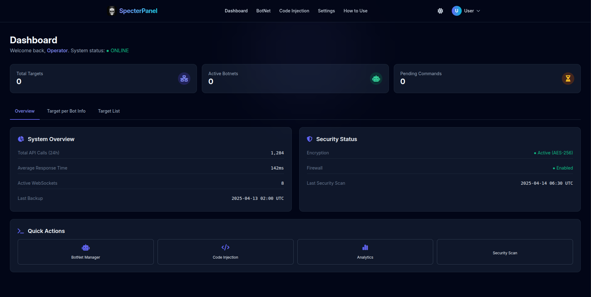
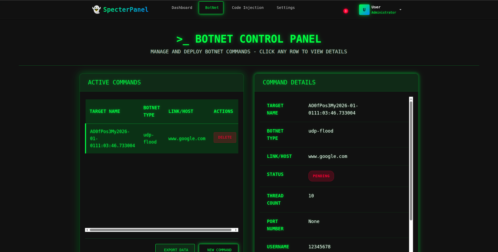
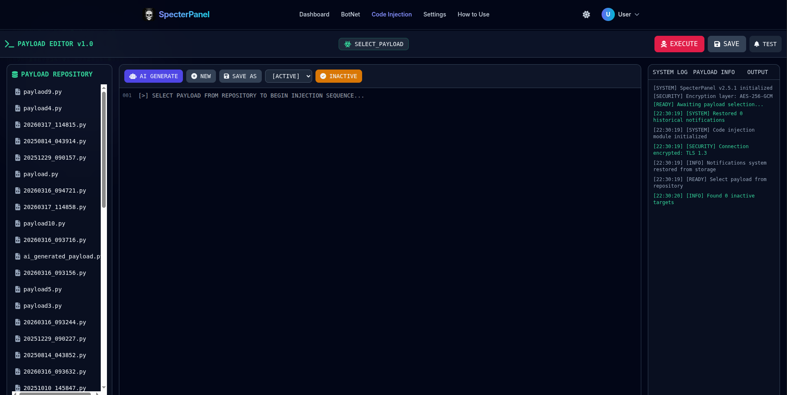
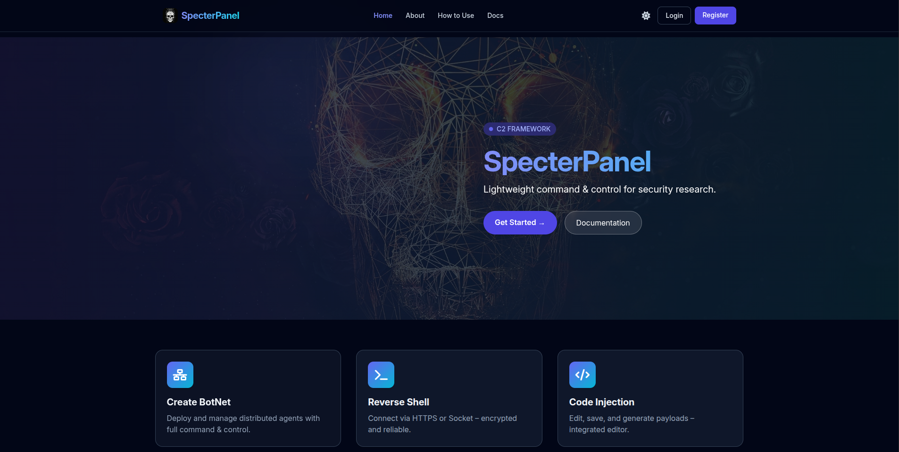
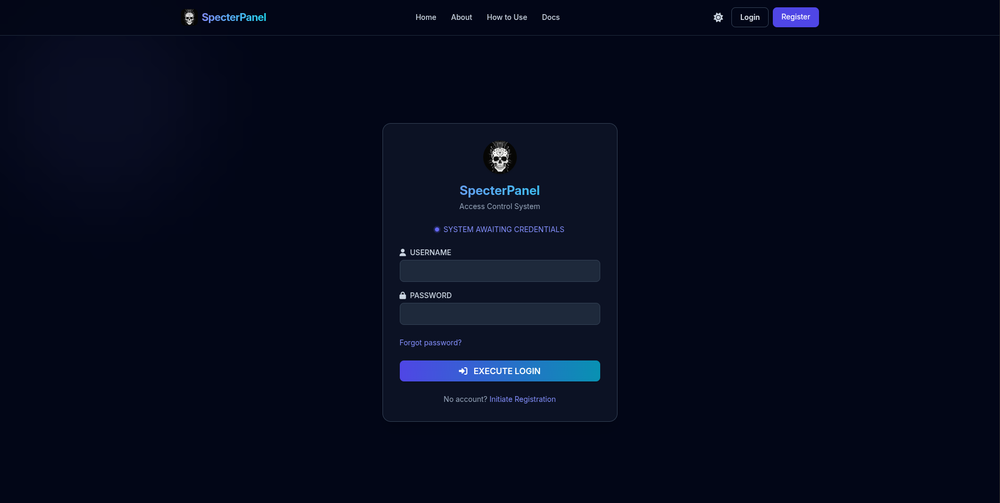
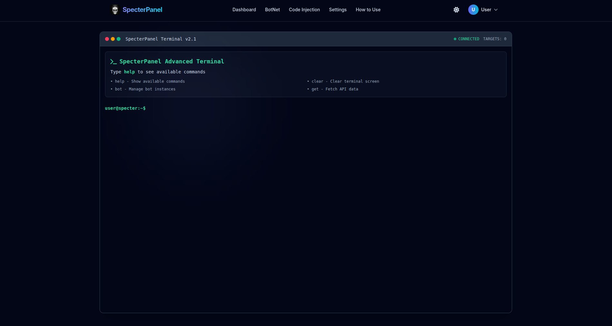
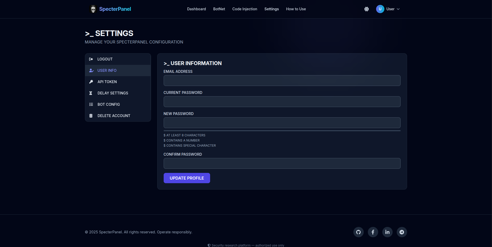

# SpecterPanel – Advanced Command & Control (C2) Platform

**SpecterPanel** is a modular, web-based Command and Control (C2) platform designed for cybersecurity professionals, penetration testers, and red teams. Built with Flask and SQLAlchemy, it provides a unified interface for managing security operations, automating tasks, and coordinating offensive security workflows in a controlled and extensible environment.

---

## 📋 Table of Contents

- [Overview](#overview)
- [Key Features](#key-features)
- [Project Structure](#project-structure)
- [Installation](#installation)
- [Usage](#usage)
- [Modules & Components](#modules--components)
- [Screenshots](#screenshots)
- [License](#license)
- [Contact](#contact)

---

## 📖 Overview

SpecterPanel delivers a comprehensive suite of tools for managing cybersecurity operations through a centralized dashboard. It integrates API management, database control, user authentication, network utilities, and modular attack panels into a single platform, enabling security teams to streamline workflows, automate tasks, and maintain operational oversight.

---

## 🚀 Key Features

- **Modular Architecture** – Easily extendable with Flask blueprints and dedicated modules.
- **Unified Dashboard** – Real-time overview of all platform activities and connected systems.
- **API Management** – Centralized control over API endpoints and command execution.
- **Database Integration** – SQLAlchemy-powered models for users, commands, logs, and more.
- **Web Terminal** – Built-in browser-based terminal for server interaction.
- **Code Playground** – Safe environment for testing and executing code snippets.
- **Botnet Management** – Dedicated panel for managing distributed systems and agents.
- **Phishing & Injection Tools** – Integrated modules for social engineering and code injection tests.
- **Event & Error Handling** – Custom error pages and logging for improved debugging.
- **Responsive UI** – Modern interface with dynamic templates and static asset support.

---

## 📁 Project Structure

```
SpecterPanel/
├── api/
│   └── api.py              # API route definitions and blueprint
├── db/
│   ├── modle.py            # SQLAlchemy models
│   ├── mange_db.py         # Database management utilities
│   └── info.json           # Database metadata or configuration
├── event/
│   └── event.py            # Error and event handlers (404, 500, etc.)
├── log/
│   └── log.txt             # Application log file
├── static/
│   ├── css/                # Stylesheets
│   ├── js/                 # JavaScript files
│   └── py/                 # Python utilities (e.g., netcat-v1.5.py)
├── utility/
│   ├── control_db.py       # Database control helpers
│   ├── email_temp.py       # Email templating utilities
│   ├── processer.py        # Data processing scripts
│   └── setting.py          # Application configuration
├── view/
│   ├── botNet_manager.py   # Botnet management interface
│   ├── code_injection_panel.py  # Code injection testing panel
│   ├── public.py           # Public routes (login, register, homepage)
│   ├── user_setting.py     # User profile and settings
│   ├── view.py             # Main view controllers
│   └── web_terminal.py     # Web terminal interface
├── templates/              # HTML templates (Jinja2)
├── app.py                  # Main Flask application
├── initial_db.py           # Database initialization script
└── requirements.txt        # Python dependencies
```

---

## ⚙️ Installation

### Prerequisites
- Python 3.8+
- pip
- git

### Steps
1. **Clone the Repository**
   ```bash
   git clone https://github.com/omerKkemal/oh-tool-v2.git
   cd oh-tool-v2
   ```

2. **Create and Activate Virtual Environment**
   ```bash
   python3 -m venv venv
   source venv/bin/activate  # On Windows: venv\Scripts\activate
   ```

3. **Install Dependencies**
   ```bash
   pip install -r requirements.txt
   ```

4. **Initialize Database**
   ```bash
   python initial_db.py
   ```

5. **Run the Application**
   ```bash
   flask run
   ```
   Access the dashboard at: [http://127.0.0.1:5000](http://127.0.0.1:5000)

---

## 🖥️ Usage

After starting the server, log in through the web interface to access:

- **Dashboard** – Overview of active sessions, tasks, and system status.
- **API Management** – Configure and monitor API endpoints.
- **Botnet Manager** – Control and monitor connected agents.
- **Code Playground** – Execute and test code in a sandboxed environment.
- **Web Terminal** – Run shell commands directly from the browser.
- **Settings** – Customize platform behavior and user preferences.

---

## 🧩 Modules & Components

| Module | Description |
|--------|-------------|
| **`app.py`** | Main Flask app, registers blueprints and configures security. |
| **`api/api.py`** | API routes for remote command execution and data exchange. |
| **`db/modle.py`** | SQLAlchemy models (User, Command, PhishingData, etc.). |
| **`view/`** | Contains all web interface controllers (dashboard, terminal, botnet, etc.). |
| **`utility/`** | Helper scripts for DB control, email templating, and settings. |
| **`event/event.py`** | Handles HTTP errors and application events. |
| **`static/`** | Frontend assets (CSS, JS, utility scripts). |
| **`templates/`** | HTML templates for all pages. |

---

## 📸 Screenshots

| Dashboard | API Link Management | Code Playground |
|-----------|---------------------|-----------------|
|  |  |  |

| Home Page | Login Interface | Web Terminal |
|-----------|-----------------|--------------|
|  |  |  |

| Settings Panel |
|----------------|
|  |

---

## 📜 License

This project is licensed under a **Proprietary License**. All rights reserved by **Omer Kemal**.

Unauthorized use, copying, modification, or distribution is strictly prohibited.  
For licensing inquiries, contact: 📧 **omerkemal2019@gmail.com**.

---

## 📬 Contact

- **Author**: Omer Kemal  
- **Email**: omerkemal2019@gmail.com  
- **GitHub**: [omerKkemal](https://github.com/omerKkemal)  

---

> ⚠️ **Disclaimer**: This tool is intended for **authorized security testing and educational purposes only**. Use responsibly and in compliance with applicable laws and regulations.
