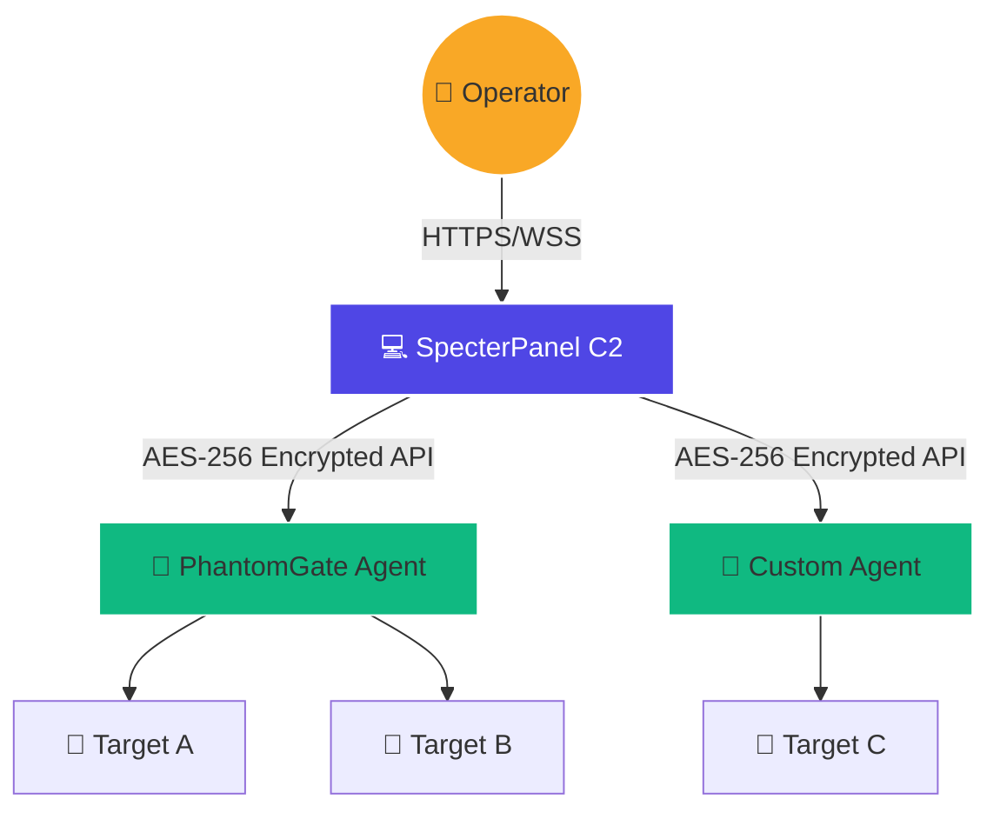

<!--- GIF Headline --->
<p align="center">
    
</p>

<p align="center">
  <strong>The Modular, Web-Based C2 Ecosystem for Modern Security Operations.</strong>
</p>

<p align="center">
  
  
  
  
  
</p>

---

<!-- DASHBOARD PREVIEW (using placeholder as image not accessible) -->
<div align="center">
  <h3>⚡ Operational Dashboard ⚡</h3>
  
  <p><em>Centralized command and real-time target overview.</em></p>
</div>

---

<!-- LEGAL & ETHICAL DISCLAIMER - HIGHLIGHTED -->
<p align="center">
  <table style="width:100%; background-color: #1a1a2e; border-left: 6px solid #ff4d4d; border-radius: 10px;">
    <tr>
      <td style="padding: 15px; color: #fff;">
        <strong>⚠️ IMPORTANT DISCLAIMER ⚠️</strong> <br>
        This tool is strictly for <strong>authorized security testing, educational purposes, and red-team engagements</strong>. Users are responsible for compliance with all applicable local, state, and federal laws. Unauthorized access to computer systems is illegal. The developers assume no liability and are not responsible for any misuse or damage caused by this program.
      </td>
    </tr>
  </table>
</p>

<br>

---

## 📋 Table of Contents
[Overview](#-overview) • [Features](#-features--capabilities) • [Architecture](#-system-architecture) • [Getting Started](#-getting-started) • [Modules](#-modules--components) • [API](#-api-reference) • [Gallery](#-screenshot-gallery) • [License](#-license)

---

## 🔭 Overview

**SpecterPanel** is a sophisticated, web-based **Command and Control (C2) framework** engineered for penetration testers, red teams, and security researchers. Built on a robust **Flask & SQLAlchemy** backbone, it provides a unified interface for orchestrating security operations, managing remote agents, and automating complex tasks.

The platform communicates with agents (like the companion **PhantomGate**) via a fully encrypted **AES-256** channel, ensuring that all operational traffic remains confidential and tamper-proof.


```mermaid
graph TD
    Operator(("👤 Operator")) -->|HTTPS/WSS| C2["💻 SpecterPanel C2"]
    C2 -->|AES-256 Encrypted API| Agent1["📡 PhantomGate Agent"]
    C2 -->|AES-256 Encrypted API| Agent2["📡 Custom Agent"]
    Agent1 --> Target1["🎯 Target A"]
    Agent1 --> Target2["🎯 Target B"]
    Agent2 --> Target3["🎯 Target C"]
    
    style C2 fill:#4f46e5,stroke:#fff,stroke-width:2px,color:#fff
    style Operator fill:#f9a826,stroke:#fff,stroke-width:2px
    style Agent1 fill:#10b981,stroke:#fff
    style Agent2 fill:#10b981,stroke:#fff
```

---

## ✨ Features & Capabilities

| Category | Feature | Description |
| :--- | :--- | :--- |
| **🧩 Core** | **Modular Architecture** | Easily extend functionality using Flask blueprints. |
| **📊 Interface** | **Unified Dashboard** | Real-time telemetry and control over all assets. |
| **🔐 Security** | **End-to-End Encryption** | AES-256-EAX for all API request/response payloads. |
| **💻 Control** | **Web-Based Terminal** | Execute system commands on remote targets directly from your browser. |
| **📦 Payloads** | **Code Injection Panel** | Upload, manage, and inject custom Python scripts into remote systems. |
| **🤖 Automation**| **Botnet Manager** | Orchestrate distributed tasks (e.g., stress testing, data collection) across agents. |
| **🗄️ Data** | **SQL Backend** | Robust data modeling for users, targets, command logs, and payloads. |
| **🔑 Auth** | **API Token Management** | Generate, revoke, and manage tokens for agent authentication. |
| **📝 Ops** | **User Instruction System** | Assign and track high-level operational instructions for targets. |
| **🌐 Comms** | **Socket Management** | Configure persistent socket-based communication channels. |

---

## 🏗️ System Architecture

```
┌─────────────────────────────────────────────────────────────────┐
│                        SpecterPanel Server                       │
├─────────────────────────────────────────────────────────────────┤
│  ┌─────────────────┐  ┌─────────────────┐  ┌─────────────────┐  │
│  │   Web Layer     │  │    API Layer    │  │   Database      │  │
│  │  (Flask Views)  │  │ (AES Encrypted) │  │  (SQLAlchemy)   │  │
│  ├─────────────────┤  ├─────────────────┤  ├─────────────────┤  │
│  │ • Dashboard     │  │ • /ApiCommand   │  │ • Users         │  │
│  │ • Terminal      │  │ • /BotNet       │  │ • Targets       │  │
│  │ • Code Inject   │  │ • /registor_target │ • APICommand    │  │
│  │ • Settings      │  │ • /injection/lib │  │ • Instraction   │  │
│  └─────────────────┘  └─────────────────┘  └─────────────────┘  │
└─────────────────────────────────────────────────────────────────┘
                              │
                      Encrypted Channel
                              │
          ┌───────────────────┴───────────────────┐
          │                                       │
┌─────────▼─────────┐                   ┌─────────▼─────────┐
│   PhantomGate      │                   │   Third-Party     │
│   Agent (Windows/  │                   │   Agents / Tools  │
│    Linux/macOS)    │                   │                   │
└───────────────────┘                   └───────────────────┘
```

### 📁 Project Structure

```bash
SpecterPanel/
├── 📂 api/                      # Encrypted API endpoints for agents
│   └── api.py
├── 📂 db/                        # Database ORM and management
│   ├── modle.py                  # SQLAlchemy models
│   ├── mange_db.py               # Session handling
│   └── info.json
├── 📂 event/                     # Global error handlers & logging
│   └── event.py
├── 📂 log/                       # Application logs
├── 📂 static/                     # Frontend assets (CSS, JS, payloads)
│   ├── css/
│   ├── js/
│   └── py/                        # Python payloads for injection
├── 📂 utility/                    # Core helpers & configuration
│   ├── control_db.py
│   ├── email_temp.py
│   ├── processer.py               # JSON/Data processing
│   └── setting.py                 # Global settings (Encryption keys)
├── 📂 view/                       # Web interface blueprints
│   ├── botNet_manager.py
│   ├── code_injection_panel.py
│   ├── public.py
│   ├── user_setting.py
│   ├── view.py
│   └── web_terminal.py
├── 📂 templates/                   # Jinja2 HTML templates
├── 📜 app.py                       # Main Flask application
├── 📜 initial_db.py                # DB initialization script
├── 📜 requirements.txt
└── 📂 screen_shot/                 # Documentation images
    ├── dashbord.png
    ├── api_link.png
    ├── code_ground.png
    └── ... (more)
```

---

## 🚀 Getting Started

### Prerequisites
*   Python 3.8 or higher
*   pip & virtualenv (recommended)
*   Git

### ⚙️ Installation in 5 Steps

```bash
# 1. Clone the repository
git clone https://github.com/omerKkemal/oh-tool-v2.git
cd oh-tool-v2

# 2. Create and activate a virtual environment
python3 -m venv venv
source venv/bin/activate   # On Windows: .\venv\Scripts\activate

# 3. Install dependencies
pip install -r requirements.txt

# 4. Initialize the database
python initial_db.py

# 5. ⚠️ SECURITY: Change the default encryption key
#    Edit 'utility/setting.py' and set ENCRYPTION_KEY to a secure 32-byte (or 16-byte) key.
#    Example: ENCRYPTION_KEY = b'your-32-byte-secret-key-here!'

# 6. Run the Flask development server
flask run
```

The platform will be available at `http://127.0.0.1:5000`.

### 🖥️ Quick Start Guide

1.  **Register**: Navigate to `/register` and create your admin account.
2.  **Login**: Access the main dashboard.
3.  **Generate Token**: Go to **Settings** and create a new API token for your first agent.
4.  **Deploy an Agent**: On a target machine, run your agent (e.g., PhantomGate) configured with the server IP and the generated token.
5.  **Control**: Watch the target appear on your dashboard. Use the **Web Terminal** to run commands or the **Code Injection** panel to deploy payloads.
6.  **Orchestrate**: Use the **BotNet Manager** to issue group commands.

---

## 🧩 Modules & Components

| Module File | Responsibility |
| :--- | :--- |
| `app.py` | Application factory, registers all blueprints, session security. |
| `api/api.py` | All encrypted agent-facing API routes. |
| `db/modle.py` | Defines `User`, `Targets`, `APICommand`, `BotNet`, `Instraction`, `Payloads` models. |
| `view/*.py` | Individual blueprints for Web UI (Dashboard, Terminal, Settings, etc.). |
| `utility/processer.py` | Core logic for command queuing, data processing. |
| `utility/setting.py` | Global config, including the crucial `ENCRYPTION_KEY`. |
| `event/event.py` | Custom error pages (404, 500) and logging setup. |

---

## 🔌 API Reference

All agent-to-server communication is encrypted using **AES-256 in EAX mode**. Agents must include a valid `api_token` in the request body (which is then encrypted along with the payload).

### Standard Encrypted Envelope

```json
{
    "nonce": "base64_encoded_nonce",
    "ciphertext": "base64_encoded_ciphertext",
    "tag": "base64_encoded_tag"
}
```

### Core Endpoints

| Method | Endpoint | Description |
| :--- | :--- | :--- |
| `GET` | `/api/v1.2/ApiCommand/<target_name>` | Retrieves all pending commands for a specific target. |
| `POST` | `/api/v1.2/Apicommand/save_output` | Receives and stores the output of executed commands. |
| `GET` | `/api/v1.2/BotNet/<target_name>` | Fetches botnet instructions (e.g., flood, brute-force) for a target. |
| `POST` | `/api/v1.2/registor_target` | Registers a new agent/target with the C2 server. |
| `GET` | `/api/v1.2/get_instraction/<target_name>` | Retrieves user-defined operational instructions. |
| `GET` | `/api/v1.2/injection/lib/<target_name>` | Serves a specific Python payload file for remote execution. |
| `POST` | `/api/v1.2/injection/code_output_save/<target_name>` | Saves the output from an injected code payload. |

---

## 📸 Screenshot Gallery

<div align="center">
  <table>
    <tr>
      <td><strong>🖥️ Dashboard</strong><br></td>
      <td><strong>💻 Web Terminal</strong><br></td>
    </tr>
    <tr>
      <td><strong>📦 Code Injection</strong><br></td>
      <td><strong>🔑 API Token Mgmt</strong><br></td>
    </tr>
    <tr>
      <td><strong>⚙️ Settings Panel</strong><br></td>
      <td><strong>🔐 Login Interface</strong><br></td>
    </tr>
  </table>
</div>

---

## 📜 License

**Proprietary License** © 2024 Omer Kemal

All rights reserved. This software and its source code are the exclusive property of Omer Kemal. Unauthorized copying, modification, distribution, or use of this software, via any medium, is strictly prohibited without explicit prior written permission.

For licensing inquiries, please contact: [omerkemal2019@gmail.com](mailto:omerkemal2019@gmail.com)

---

## 📬 Contact & Community

<div align="center">
  <a href="https://github.com/omerKkemal">
    
  </a>
  <a href="mailto:omerkemal2019@gmail.com">
    
  </a>
  <a href="https://github.com/omerKkemal/oh-tool-v2">
    
  </a>
</div>

---

<p align="center">
  
  <br>
  <sub>Built with ⚡ by security professionals, for security professionals.</sub>
  <br>
  <sub>© 2024 SpecterPanel. Authorized Use Only.</sub>
</p>
