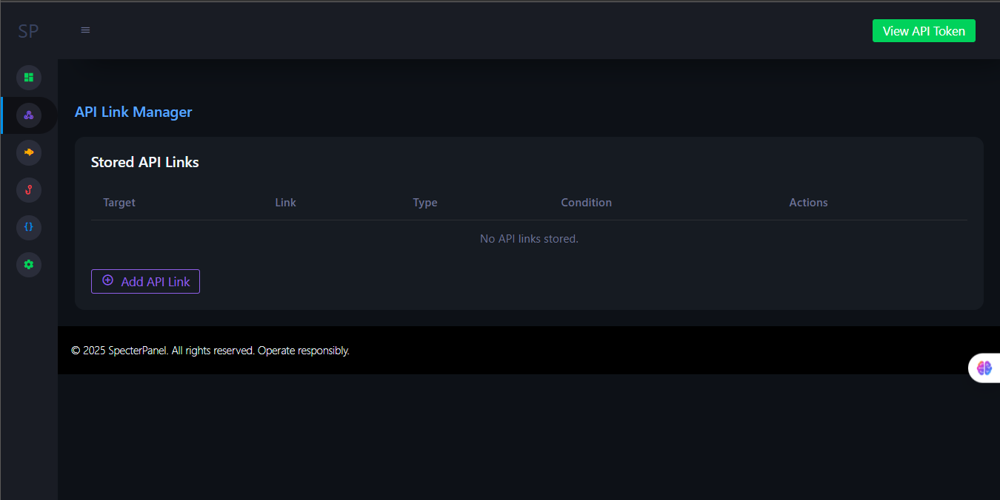
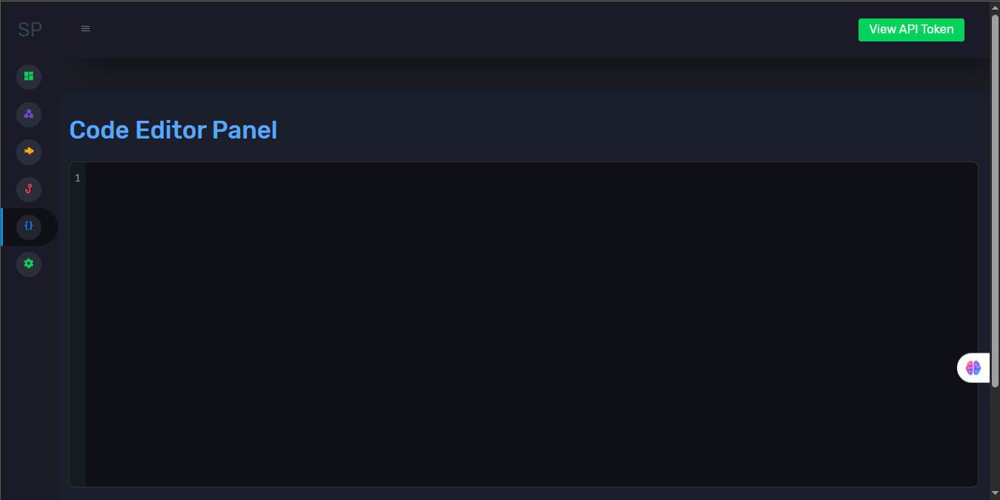
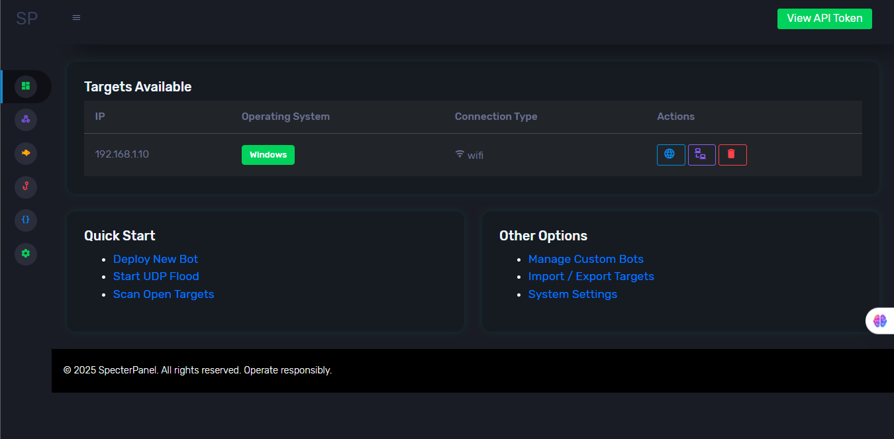
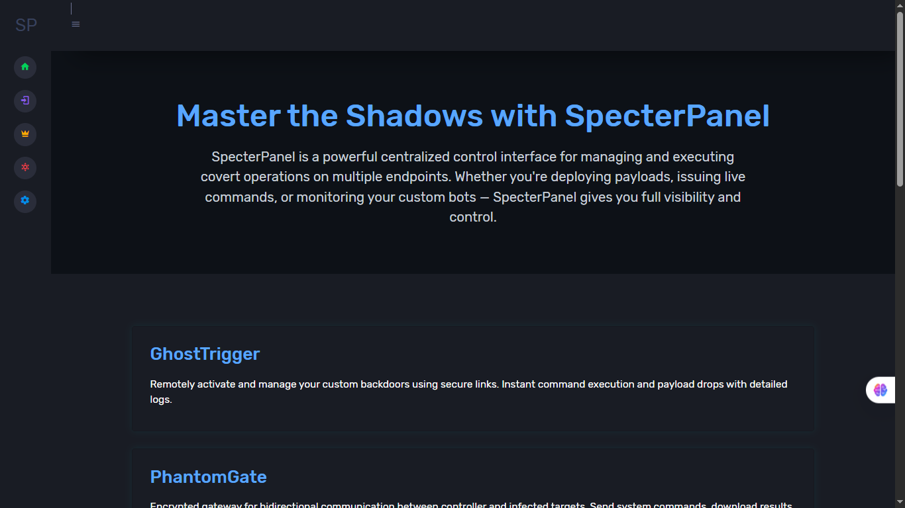
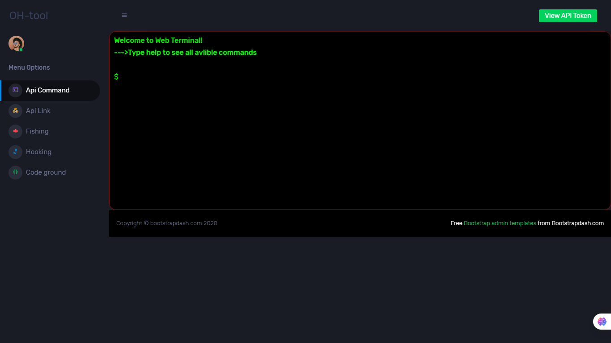

# SpecterPanel (C2 Server)

**SpecterPanel** is a sophisticated Command and Control (C2) platform designed to deliver a comprehensive suite of functionalities for cybersecurity professionals and penetration testers. Developed with Flask and SQLAlchemy, SpecterPanel features a modular architecture that facilitates seamless management of various operational tasks.

## Explanation

SpecterPanel provides an all-in-one web-based interface for managing security operations and conducting penetration testing activities. It streamlines workflows by integrating multiple modules—such as API management, database control, user authentication, and network utilities—into a unified system. Designed for flexibility and extensibility, SpecterPanel enables users to efficiently oversee and automate complex security operations, making it a valuable tool for security teams and professionals.

## Table of Contents

- [Explanation](#explanation)
- [Screenshots](#screenshots)
- [Installation](#installation)
- [Usage](#usage)
- [Features](#features)
- [Contributing](#contributing)
- [License](#license)

## Screenshots

Below are some screenshots illustrating key features and user interfaces of SpecterPanel:

### API Link Management


### Code Playground


### Dashboard Overview


### Home Page


### Login Interface


### Application Settings


### Web Terminal


## Installation

To set up SpecterPanel on your system, follow these steps:

1. **Clone the Repository**
    ```bash
    git clone https://github.com/omerKkemal/oh-tool-v2.git
    cd oh-tool-v2
    ```

2. **Create a Virtual Environment**
    ```bash
    python3 -m venv venv
    source venv/bin/activate
    ```

3. **Install Dependencies**
    ```bash
    pip install -r requirements.txt
    ```

4. **Initialize the Database**
    ```bash
    python initial_db.py
    ```

## Usage

1. **Start the Application**
    ```bash
    flask run
    ```

2. **Access the Dashboard**
    Open your web browser and navigate to: [http://127.0.0.1:5000](http://127.0.0.1:5000)

## Features

SpecterPanel is designed with extensibility and user experience in mind. The following modules are included:

### Main Application (`app.py`)
- Initializes the Flask application.
- Registers modular blueprints for different functionalities.
- Configures session management and application security.

### API Handling (`api/api.py`)
- Organizes and defines API routes for command execution.
- Utilizes Flask blueprints for scalable API development.

### Database Models (`db/modle.py`)
- Implements database schema using SQLAlchemy ORM.
- Defines models for users, API commands, API links, phishing data, and more.

### Views and Templates (`view/view.py`, `templates`)
- Renders dynamic HTML templates for all major user-facing routes.
- Includes user profile management, command execution, and additional web interfaces.

### Event Handling (`evet/event.py`)
- Manages application-level error handling (e.g., 404, 500 error pages).

### Database Initialization (`initial_db.py`)
- Provides automated scripts for initial database setup.

### Utility Functions (`utility/control_db.py`, `utility/setting.py`)
- Contains helper scripts for database management and application configuration.
- Facilitates streamlined SQLite operations and environment settings.

### Homepage and Public Pages (`homePage/public.py`)
- Handles authentication processes including login and registration.
- Manages public informational pages with secure session handling.

### Static Files (`static/py/netcat-v1.5.py`)
- Includes a robust network utility script for advanced network operations.

## Contributing

We welcome contributions from the community! To contribute, please open an issue or submit a pull request with detailed information about your changes.

## License

This project is licensed under the MIT License. For more information, please refer to the [LICENSE](LICENSE) file.
